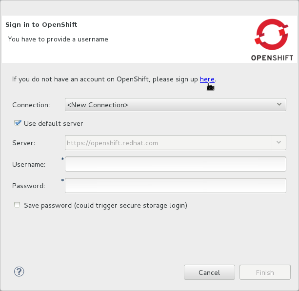

= OpenShift Tools

= Overview of OpenShift Tools

== About OpenShift

OpenShift is Red Hat's Platform as a Service (PaaS) for applications. It
consists of an application platform in the cloud, enabling you to build,
test and run applications in a cloud architecture. OpenShift provides
disk space, CPU resources, network connectivity, and a runtime
environment.

OpenShift has a number of key features to assist you in developing and
deploying applications:

* Unique domain names, or namespaces, support the hosting of your
applications. A user account provides you with access to domains, the
latter having the potential to be associated with multiple applications.
* Numerous cartridges give you access to popular language, database and
management frameworks. OpenShift can also be customized, allowing you to
add APIs of your choice.
* Gears provide RAM and disk space for your applications and cartridges.
OpenShift currently provides two gear sizes:
** Small - 512MB of RAM, 100MB of swap space, and 1GB of disk space
(expandable)
** Medium - 1GB of RAM, 100MB of swap space, and 1GB of disk space
(expandable)
+
You can use up to three small gears as part of OpenShift Online with
Free Plan, a free OpenShift user account, and extend to more gears and
bigger gears with OpenShift Online with Silver Plan or OpenShift
Enterprise. OpenShift offers flexibility by letting you choose the
number of gears to assign to your application.
* Built-in administrative and stack management frees you up to focus on
code development. OpenShift manages the intricate details of deploying
your application to the stack and interfacing with middleware
technologies for you.
* Automatic or manual scaling of the resources supporting your
applications ensure that application performance does not suffer as
usage increases. OpenShift can create additional instances of your
application and enable clustering.

OpenShift can be accessed via the web interface at
https://www.openshift.com/[] on the OpenShift website or via the
OpenShift command line interface.

== About OpenShift Tools

OpenShift Tools is tooling available within the IDE for OpenShift. It
provides an alternative way of accessing OpenShift and managing the
development of applications deployed there.

OpenShift Tools consists of a set of wizards and actions, which together
provide core functionality for developing OpenShift applications:

* The tools prepare you for working with OpenShift, by assisting you to
create OpenShift user accounts and domains.
* OpenShift Tools assists you with the essential tasks of setting up
your system and the IDE for OpenShift interaction, such as creating
connections and generating and uploading SSH keys.
* When creating and developing OpenShift applications, OpenShift Tools
provides wizards for creating new and importing existing OpenShift
applications.
* A variety of actions are available for managing deployed applications,
for tasks such as restarting applications, uploading changes to
applications, viewing OpenShift server output, and deleting
applications.

= Features of OpenShift Tools

== Features Overview

The aim of this section is to guide you in using OpenShift Tools:

* Create OpenShift user accounts and connect to OpenShift
* Generate SSH keys and upload them to an OpenShift user account
* Create and manage domains
* Create new OpenShift applications from within the IDE
* Deploy existing applications in the IDE to OpenShift and import
existing OpenShift applications into the IDE
* Manage deployed OpenShift applications and view information about them

== Create an OpenShift User Account

To begin using OpenShift, you need to create an OpenShift user account.
OpenShift Tools provides the ability to create a user account from
within the IDE.

To create a user account, click the OpenShift Explorer tab. If the
OpenShift Explorer tab is not visible, click Window→Show View→Servers.

image:images/3935.png[ click the OpenShift Explorer tab. ]

Click the Connect to OpenShift icon image:images/3946.png[image] and
click the link to sign up for an account. This opens
https://openshift.redhat.com/app/account/new[] in a browser tab. Follow
the instructions on the OpenShift web page to create an account. Once
created, you can close the browser tab.

Management of your user account, such as changing or resetting your
password, must be carried out through the OpenShift management console
at
https://openshift.redhat.com/app/login?redirectUrl=%2Fapp%2Fconsole[].

== Connect to OpenShift

Once you have an OpenShift user account, you can connect to OpenShift
and then create domains and applications. The procedure below guides you
through setting up a connection to OpenShift using your user account
information.

Click the OpenShift Explorer tab and click the Connect to OpenShift icon
image:images/3946.png[image].

From the Connection list, select New Connection.

image:images/3929.png[ From the Connection list, select New Connection.
]

If you want to use a server other than the default at
https://openshift.redhat.com, clear the Use default server check box and
in the Server field type the address of the server.

____________________________________________________________________________________________________________________
*Note*

There are a number of OpenShift servers from which you can choose:

* OpenShift Online is the public cloud offering and it is hosted at
https://openshift.redhat.com[].
* OpenShift Enterprise is a private cloud, obtained through a
subscription and hosted in a private data center.
* OpenShift Origin is a local cloud, available to download and install
locally for development and testing purposes.
____________________________________________________________________________________________________________________

In the Username and Password fields, type your OpenShift user account
authentication information.

If you want the Password field to automatically populate for this
connection in future, select the Save password check box.

_______________________________________________________________________________________________________________________________________________________________________________________
*Note*

The password is retained in secure storage provided by the IDE. To
manage the settings for secure storage, click Window→Preferences, expand
General→Security and select Secure Storage.
_______________________________________________________________________________________________________________________________________________________________________________________

Click Finish for OpenShift Tools to connect to OpenShift.

If your credentials are incorrect, the Sign in to OpenShift wizard
remains open for you to change your authentication information.

If you selected for your password to be saved, you are prompted to enter
your secure storage password or, if this is your first use of secure
storage, you are prompted to set a secure storage password.

Once your credentials are verified as correct, the wizard closes and a
live OpenShift connection is listed in the OpenShift Explorer tab.

image:images/3940.png[ Once your credentials are verified as correct,
the wizard closes and a live OpenShift connection is listed in the
OpenShift Explorer tab. ]

When you close the IDE, any live OpenShift connections will be
disconnected but they can be easily reestablished. OpenShift Tools lists
previous connections in the OpenShift Explorer tab until cleared by you.
In the OpenShift Explorer tab, double-click or expand the appropriate
connection to open an automatically completed connection wizard. Type
your password or the master password, if using the saved password
facility, and click Finish.

== Manage a Connection

Using OpenShift Tools, you can view and manage live OpenShift
connections.

View information about a connection::
  In the OpenShift Explorer tab, right-click the connection and click
  Properties. The Properties tab opens and shows information about the
  associated domains, key and user account. The Key parameter is unique
  to the connection and it is used by the IDE for identification
  purposes.
  +
  image:images/3933.png[ In the OpenShift Explorer tab, right-click the
  connection and click Properties. The Properties tab opens and shows
  information about the associated domains, key and user account. The
  Key parameter is unique to the connection and it is used by the IDE
  for identification purposes. ]
Refresh information about a connection::
  In the OpenShift Explorer tab, right-click the connection and click
  Refresh. Information is retrieved from OpenShift and the OpenShift
  Explorer tab updated as appropriate. This action is useful if you are
  simultaneously making changes to your domains and applications in the
  IDE and the OpenShift web interface or command line interface.
  Additionally, it may be used to recover from errors.
Delete a connection::
  In the OpenShift Explorer tab, right-click the connection and click
  Remove from View.

== Generate and Upload SSH keys to OpenShift

SSH keys are essential when working with OpenShift. They enable you to
develop and access deployed applications. SSH keys are also used to
control access of other contributors to your OpenShift applications. SSH
keys must be uploaded to the OpenShift server and, as detailed in the
procedure below, OpenShift Tools can assist with both the generation and
uploading of SSH keys to OpenShift.

In the OpenShift Explorer tab, right-click the connection and click
Manage SSH Keys.

To create a new SSH private-public key pair, click New.

In the Name field, type a name for the key pair that will be used by
OpenShift to distinguish the key pair from others associated with your
account.

image:images/3936.png[ To create a new SSH private-public key pair,
click New. ]

From the Key Type list, select SSH_RSA.

Ensure the SSH2 Home field contains the location where you want to
create the files associated with the key pair. To change the location,
clear the Default check box and type the location in the SSH2 Home field
or click Browse to navigate to the desired location.

_________________________________________________________________________________________________________________________________________________________________________________________________________________________________________________________________________________________________
*Note*

The default location for creating SSH key files is determined by the SSH
information for the IDE. The default location can be altered by clicking
Windows→Preferences, expanding General→Network Connections, selecting
SSH2 and changing the location in the SSH2 home field of the General
tab.
_________________________________________________________________________________________________________________________________________________________________________________________________________________________________________________________________________________________________

In the Private Key File Name field, type a name for the private key
file.

In the Private Key Passphrase field, type a passphrase for use in
accessing the private key. This field is not mandatory and can be left
empty if you want.

In the Public Key File Name field, type a name for the public key file.
Typically the file name of the public key is that of the private key
with `.pub` appended.

Click Finish. The SSH key pair will be generated and the public key
automatically uploaded to OpenShift.

Click OK to close the Manage SSH Keys window.

== Manage SSH Keys

OpenShift Tools provides actions for managing the SSH keys of your
OpenShift account.

Upload an existing public SSH key to OpenShift::
  In the OpenShift Explorer tab, right-click the connection and click
  Manage SSH Keys. Click Add Existing. In the Name field, type a name
  for the key that will be used by OpenShift to distinguish the key from
  others associated with your account. Click Browse to navigate to the
  public key file. Click Finish and click OK to close the Manage SSH
  Keys window.
Remove a public SSH key from OpenShift::
  In the OpenShift Explorer tab, right-click the connection and click
  Manage SSH Keys. From the SSH Public Keys table select the key you
  want to remove from your OpenShift account and click Remove. At the
  prompt asking if you are sure you want to remove the key, click OK.
  Click OK to close the Manage SSH Keys window.
  +
  _______________________________________________________________________________________________________________________________________________________________________________________________________________________________________________________________
  *Note*

  Remove only disassociates keys with your OpenShift account. The files
  associated with a 'removed' SSH public-private key pair still exist in
  the local location where they were generated and can be uploaded again
  to OpenShift using the Add Existing action.
  _______________________________________________________________________________________________________________________________________________________________________________________________________________________________________________________________
Refresh the SSH key information associated with OpenShift::
  In the OpenShift Explorer tab, right-click the connection and click
  Manage SSH Keys. Click Refresh and click OK to close the Manage SSH
  Keys window. It may be necessary to use this action if you make
  changes to your OpenShift SSH key settings through the OpenShift web
  interface while the IDE is open with a live OpenShift connection.

== Create a Domain

Once you have an OpenShift user account, you need to create domains in
which to host your applications. Note that user accounts for OpenShift
Online with Free plan can be associated with one domain only. The
procedure below guides you through creating a new domain but you first
need a live connection. If you already have a domain associated with
your user account then domain information will be automatically passed
to the IDE when a live connection is started.

In the OpenShift Explorer tab, right-click the connection and click
New→Domain. Alternatively, right-click the connection, click Manage
Domains and click New.

In the Domain Name field, type the name of the domain you would like to
use and click Finish. The name you provide will be appended with
`.rhcloud.com`. Domain names must be unique so if the name you have
chosen is already in use you will see a warning. In this case, choose
another name and try again until you have a unique one.

image:images/3945.png[ In the Domain Name field, type the name of the
domain you would like to use and click Finish. ]

_______________________________________________________________________________________________________________________________________________________________
*Note*

There are restrictions on the name you can use for a domain. Names must
consist only of alphanumeric characters and can have a maximum length of
16 characters.
_______________________________________________________________________________________________________________________________________________________________

== Manage a Domain

OpenShift Tools provides actions for managing the domains of your
OpenShift account.

View the domains associated with a connection::
  In the OpenShift Explorer tab, right-click the connection and click
  Manage Domains. Alternatively, right-click the connection and click
  Properties. The Properties tab will open, where the first row of the
  table contains the names of the domains.
Rename a domain::
  In the OpenShift Explorer tab, right-click the domain and click Edit
  Domain. Alternatively, right-click the connection and click Manage
  Domains. From the Domains table, select the domain and click Edit. In
  the Domain Name field, type the new name of the domain and click
  Finish. You cannot change the name of a domain which has associated
  applications.
  +
  ______________________________________________________________________________
  *Important*

  Renaming your domain changes the public URLs of applications you later
  create.
  ______________________________________________________________________________
Delete a domain::
  In the OpenShift Explorer tab, right-click the domain and click Delete
  Domain. Alternatively, right-click the connection and click Manage
  Domains. From the Domains table, select the domain and click Remove.
  You cannot delete a domain that has any applications associated with
  it unless, at the prompt, you check the Force applications deletion
  check box. Click OK to complete the deleting action.
  +
  ___________________________________________________________________________________________________________________________________________________________________________________________________________________________________________________________________________________
  *Note*

  Forcing the deletion of applications results in the applications being
  deleted from the OpenShift server. The projects of applications will
  still be visible in the Project Explorer and Git Repositories tab as
  the local clone of the Git repository for projects is not deleted.
  ___________________________________________________________________________________________________________________________________________________________________________________________________________________________________________________________________________________

== Deploy a New or Existing Application on OpenShift

OpenShift Tools provides the OpenShift Application wizard to assist you
in creating and deploying OpenShift applications.

OpenShift applications can be created using an existing workspace
project, a Git source or a default project template, as detailed in the
procedure below. For of an existing workspace project, the wizard merges
the existing project contents with the key metadata files from a new
OpenShift application so that the application can be deployed on
OpenShift. For a Git source, the wizard uses the source as the new
OpenShift application so the source must be OpenShift-enabled, namely
have a `.openshift` directory and have the openshift profile specified
in the `pom.xml`.

Before deploying OpenShift applications, the wizard assists you in
setting up linked remote (OpenShift server) and local Git repositories
containing the original and clone of your project, respectively. You can
then push project changes to OpenShift via git or allow the OpenShift
Server Adapter do it for you.

To create an OpenShift application, you must have a domain and, in the
case that you do not have a domain already set up, the wizard will
prompt and guide you in creating one first.

___________________________________________________________________________________________________________
*Important*

You must have SSH keys set up first in order to successfully proceed
with the OpenShift Application wizard.
___________________________________________________________________________________________________________

In the OpenShift Explorer tab, right-click the connection or domain and
click New→Application. Alternatively, in JBoss Central click OpenShift
Application, after which you are prompted to select an OpenShift
connection and provide your user authentication information.

image:images/3932.png[ In JBoss Central click OpenShift Application. ]

Complete the fields as appropriate:

* From the Domain list, select the domain to which to assign the
application.
* In the Name field, type a name for the new OpenShift application.
There are restrictions on the name you can use for an application. Names
must consist only of alphanumeric characters. In the case of an existing
workspace project, for simplicity you may choose the OpenShift
application name to be the same as the name of the workspace project.
* From the Type list, select a runtime server. This will ensure the
necessary core programming or technology cartridge is added to your
application.
* From the Gear profile list, select the gear size. This is RAM and disk
space required by your applications and its cartridges. If you are using
OpenShift Online with Free Plan, you have access to small gears only.
* If you want OpenShift to automatically increase the instances of your
application and enable clustering as usage increases, select the Enable
scaling check box.
* From the Embedded Cartridges list, select the functionality you want
to enable in your application. This will add associated capabilities and
support to your application.
* To specify that the new application is to be based on source code from
an existing Git repository, click Advanced and clear the Use default
source code check box. In the Source code field, type the URL of the
source code location.
* To declare environment variables to be used when the application is
run, click Advanced and click Environment Variables. Click Add to
declare an environment variable. In the Name and Value fields, type a
name and value for the environment variable respectively. Click OK to
save the information and click OK to close the Environment Variables
window.

image:images/3938.png[ Complete the fields of the wizard page. ]

Click Next.

Complete the fields as appropriate:

* To specify that the new application is to be based on an existing
workspace project, clear the Create a new project check box and in the
Use existing project field type the name of the project or click Browse
to locate the project. Otherwise, ensure the Create a new project check
box is selected.
* Ensure the Create and set up a server for easy publishing check box is
selected. This option automatically creates an OpenShift server adapter
for the application, enabling you to easily upload changes to the
OpenShift server.
* To disable Maven builds, check the Disable automatic Maven builds when
pushing to OpenShift check box. This informs OpenShift not to launch the
Maven build process when the Maven project is pushed to OpenShift but to
put the deployment straight into the deployments folder. It is useful
when you want to push applications already built for deployment rather
than source code.

Click Next.

The Location field shows the location that will be used for the local
Git repository. The location must already exist to be able to proceed
with the wizard. To change the location, clear the Use default location
check box and type the location in the Location field or click Browse to
navigate to the desired location.

image:images/3937.png[ The Location field shows the location that will
be used for the local Git repository. The location must already exist to
be able to proceed with the wizard. To change the location, clear the
Use default location check box and type the location in the Location
field or click Browse to navigate to the desired location. ]

Click Finish. If you are prompted that the authenticity of the host
cannot be established and asked whether you want to continue connecting,
check that the host name matches that of your application and domain and
click Yes.

At the prompt asking if you want to publish committed changes to
OpenShift, click Yes. The progress of the application creation process
is visible in the Console tab.

Once created, the application is listed under the connection in the
OpenShift Explorer tab. The application type proceeds the application
name. The project is also listed in the Project Explorer and Git
Repositories tabs, where the details proceeding the application name
indicate the current Git branch and status compared to the remote
repository. Additionally, the server adapter for the application is
visible in the Servers tab.

______________________________________________________________________________________________________________________________________________________________________________________________________________________________________________________________________
*Note*

To view the project in the Git Repositories tab, in the Project Explorer
tab right-click the project name and click Team→Show in Repositories
View. Alternatively, click Window→Show View→Other, expand Git and select
Git Repositories. Click OK to close the window.
______________________________________________________________________________________________________________________________________________________________________________________________________________________________________________________________________

== Import a Deployed OpenShift Application into the IDE

All applications deployed on OpenShift are listed under live connections
in the OpenShift Explorer tab. But only the project files of OpenShift
applications created through the IDE will be immediately available in
the Project Explorer and Git Repositories tabs. If you want to work on
the project files associated with an application, you must first import
the application. OpenShift Tools can assist you to import your deployed
OpenShift applications into the IDE, as detailed in the procedure below.

Click File→Import, expand OpenShift, select Existing OpenShift
Application and click Next. Alternatively, in the OpenShift Explorer
tab, right-click the application and click Import Application.

Ensure the Use existing application check box is selected and type the
name of the application in the text field. This field has an
auto-completion feature to assist you in typing the application name or
click Browse to see a list of all of your applications associated with
the connection.

__________________________________________________________________________________________________________________________________________________________________________________________________________________________________________________________________________________________________________________________________________________________________________________
*Important*

Project names in the IDE workspace must be unique. If the name of the
application you want to import is identical to an existing project in
the workspace, the OpenShift Tools will not complete the import. To work
around this constraint, you can import the OpenShift application to
another workspace or change the name of one of the conflicting projects
and applications.
__________________________________________________________________________________________________________________________________________________________________________________________________________________________________________________________________________________________________________________________________________________________________________________

image:images/3941.png[ Ensure the Use existing application check box is
selected and type the name of the application in the text field. This
field has an auto-completion feature to assist you in typing the
application name or click Browse to see a list of all of your
applications associated with the connection. ]

Click Next.

Ensure the Create a new project and Create and set up a server for easy
publishing check boxes are selected. The latter will automatically
create an OpenShift server adapter for the application, enabling you to
easily upload changes to the OpenShift server.

To disable Maven builds, check the Disable automatic Maven builds when
pushing to OpenShift check box. This informs OpenShift not to launch the
Maven build process when the Maven project is pushed to OpenShift but to
put the deployment straight into the deployments folder. It is useful
when you want to push applications already built for deployment rather
than source code.

Click Next.

The Location field shows the location that will be used for the local
Git repository. The location must already exist to be able to proceed
with the wizard. To change the location, clear the Use default location
check box and type the location in the Location field or click Browse to
navigate to the desired location.

Click Finish. If you are prompted that the authenticity of the host
cannot be established and asked whether you want to continue connecting,
check that the host name matches that of your application and domain and
click Yes.

OpenShift Tools modified the .gitignore file on importing the
application. At the prompt asking if you want to publish committed
changes to OpenShift, click Yes. The progress of the import process is
visible in the Console tab.

Once imported, the project is listed in the Project Explorer and Git
Repositories tabs, where the details proceeding the application name
indicate the current Git branch and status compared to the remote
repository. Additionally, the server adapter for the application is
visible in the Servers tab.

== Generate a Server Adapter for an Application

In order to easily publish changes to a deployed OpenShift application,
each application needs a server adapter. The OpenShift Application
wizard can automatically generate server adapters for new or imported
OpenShift applications if you select the Create and set up a server for
easy publishing check box. But OpenShift also provides an action to
assist you in generating server adapters for OpenShift application that
already exist in the IDE, as detailed in the procedure below. You can
use this action if you need to regenerate a deleted server adapter for
an OpenShift application or if you create or import an OpenShift
application and do not select the Create and set up a server for easy
publishing check box.

In the OpenShift Explorer tab, expand the connection.

Right-click the application name and click Create a Server Adapter.

From the list of server types, expand OpenShift and select OpenShift
Server.

image:images/3931.png[ From the list of server types, expand OpenShift
and select OpenShift Server. ]

The Server's host name and Server name field are automatically completed
but you can change the contents of both as you need. The Server's host
name field contains the host name of the server and the Server name
field contains the name by which the server adapter is know in the
Servers tab.

Once the fields are complete, click Next.

Ensure the Connection, Application Name and Deploy Project fields
contain the correct information relating to the application for which
you want to generate the server adapter.

image:images/3930.png[ Ensure the Use existing application check box is
selected and type the name of the application in the text field. This
field has an auto-completion feature to assist you in typing the
application name or click Browse to see a list of all of your
applications associated with the connection. ]

In the Remote field, type the alias for the remote Git repository. For
OpenShift applications created and imported by OpenShift Tools this is
`origin`.

In the Output Directory field, type the location where archived projects
for deployment should be stored or click Browse to navigate to the
desired location.

Click Next.

From the Available list, select the project for which the server adapter
is being generated and click Add. The application is now listed under
Configured.

Click Finish for OpenShift Tools to generate the server adapter. Once
generated, the server adapter is listed in the Servers tab.

image:images/3947.png[ Click Finish for OpenShift Tools to generate the
server adapter. Once generated, the server adapter is listed in the
Servers tab. ]

== View a Deployed Application and Associated Information

OpenShift Tools provides actions for viewing deployed OpenShift
applications and information about them.

View a deployed application::
  In the OpenShift Explorer tab, expand the connection. Right-click the
  application name and click Web Browser. A browser tab opens displaying
  your deployed application. Alternatively, in the Servers tab,
  right-click the server adapter for the application and click Show
  In→Web Browser.
View information about an application::
  In the OpenShift Explorer tab, expand the connection. Right-click the
  application name and click Details. The displayed information includes
  the public URL of the application, application type, and remote Git
  repository location. Click OK to close the Details window.
  +
  image:images/3944.png[ In the OpenShift Explorer tab, expand the
  connection. Right-click the application name and click Details. The
  displayed information includes the public URL of the application,
  application type, and remote Git repository location. Click OK to
  close the Details window. ]
View output from the OpenShift server::
  In the OpenShift Explorer tab, expand the connection. Right-click the
  application name and click Tail files. Alternatively, right-click the
  server adapter of the application in the Servers tab and click
  OpenShift→Tail files. The Tail Log Files window opens, with either the
  default retrieval syntax or last used syntax for this application in
  the Tail options field.
  +
  To change the retrieval command, in the Tail options field type the
  appropriate syntax. To specify the gears for which to show the server
  logs, from the Cartridges table select the check boxes of the
  appropriate gears. Click Finish for OpenShift to retrieve the output,
  which is displayed in a different Console tab for each gear.
  +
  image:images/3927.png[ In the OpenShift Explorer tab, expand the
  connection. Right-click the application name and click Tail files.
  Alternatively, right-click the server adapter of the application in
  the Servers tab and click OpenShift→Tail files. The Tail Log Files
  window opens, with either the default retrieval syntax or last used
  syntax for this application in the Tail options field. To change the
  retrieval command, in the Tail options field type the appropriate
  syntax. To specify the gears for which to show the server logs, from
  the Cartridges table select the check boxes of the appropriate gears.
  Click Finish for OpenShift to retrieve the output, which is displayed
  in a different Console tab for each gear. ]
View values of variables associated with an application::
  In the OpenShift Explorer tab, expand the connection. Right-click the
  application name and click All Environment Variables. Variable names
  and values are listed in the Console tab. Alternatively, in the
  Servers tab, right-click the server adapter of the application and
  click OpenShift→Environment Variables.
  +
  image:images/3942.png[ In the OpenShift Explorer tab, expand the
  connection. Right-click the application name and click Environment
  Variables. Variable names and values are listed in the Console tab.
  Alternatively, in the Servers tab, right-click the server adapter of
  the application and click OpenShift→All Environment Variables. ]
View properties of cartridges associated with an application::
  In the OpenShift Explorer tab, expand the connection and the
  application. Right-click the cartridge and click properties. The
  Properties tab opens and lists information about the cartridge.
View information about the server of an application::
  In the Servers tab, double-click the server adapter for the
  application. A Server Editor tab opens, enabling viewing and editing
  of server details. To save any changes, press Ctrl+S or click
  File→Save or click the Save icon.
Refresh information about an application::
  In the OpenShift Explorer tab, right-click the connection and click
  Refresh. Information is retrieved from OpenShift and the OpenShift
  Explorer tab updated as appropriate. This action is useful if you are
  simultaneously making changes in the IDE and the OpenShift web
  interface or command line interface to your domain and applications.
  Additionally, it may be used to recover from errors.

== Manage a Deployed Application

OpenShift Tools provides actions for developing and managing deployed
OpenShift applications.

Upload modifications to a deployed application::
  In the Severs tab, right-click the server adapter for the application
  and click Publish. At the prompt asking if you want to publish to
  OpenShift by committing changes to Git, you can customize the default
  commit message `Commit from JBoss Tools`. Click OK and changes,
  together with the commit message, are pushed to the remote Git
  repository. Additionally, the application is automatically updated on
  the OpenShift server and the Console tab displays OpenShift server
  output.
  +
  ____________________________________________________________________________________________________________________________________________________________________________________________________________________
  *Note*

  To view a log of changes to the local git repository, in the Git
  Repositories tab, right-click a repository and click Show In→History.
  The History tab opens, showing a log of commits for the local Git
  repository.
  ____________________________________________________________________________________________________________________________________________________________________________________________________________________
Edit environment variables associated with an application::
  In the OpenShift Explorer tab, expand the connection. Right-click the
  application name and click Edit Environment Variables. Click Add, Edit
  or Remove to customize the environment variables. Click Finish to
  close the window.
Add or remove markers associated with an application::
  In the Project Explorer tab, right-click the application and click
  OpenShift→Configure Markers. Select or clear the check boxes of
  markers as desired. Information about markers is given in the Marker
  Description section of the Configure OpenShift Markers Window. Click
  OK for your marker choice to be applied to the application.
  +
  image:images/3939.png[ In the Project Explorer tab, right-click the
  application and click OpenShift→Configure Markers. Select or clear the
  check boxes of markers as desired. Information about markers is given
  in the Marker Description section of the Configure OpenShift Markers
  Window. Click OK for your marker choice to be applied to the
  application. ]
Add or remove cartridges associated with an application::
  In the OpenShift Explorer tab, expand the connection. Right-click the
  application name and click Edit Embedded Cartridges. Select or clear
  the check boxes of cartridges as desired. Click Finish for your
  cartridge choice to be applied to the application. You are prompted if
  the cartridges you have chosen to add or remove require further
  action, such as the addition of prerequisite cartridges or removal of
  conflicting cartridges. You can choose to ignore or apply the
  suggestions of the prompt.
  +
  image:images/3943.png[ Right-click the application name and click Edit
  Embedded Cartridges. Select or clear the check boxes of cartridges as
  desired. Click Finish for your cartridge choice to be applied to the
  application. ]
Restart an application::
  In the OpenShift Explorer tab, expand the connection. Right-click the
  application name and click Restart. Alternatively, right-click the
  server adapter of the application in the Servers tab and click
  OpenShift→Restart Application.
Forward remote ports::
  You can forward the remote ports of the OpenShift server to your
  workstation to enable access to various services, such as MySQL. Port
  forwarding is available for all OpenShift applications, including
  scalable ones.
  +
  ________________________________________________________________________________
  *Important*

  Your application must be running before attempting to configure port
  forwarding.
  ________________________________________________________________________________
  +
  In the OpenShift Explorer tab, expand the connection. Right-click the
  application name and click Port forwarding. Alternatively, right-click
  the server adapter of the application in the Servers tab and click
  OpenShift→Port forwarding.
  +
  image:images/3934.png[ In the OpenShift Explorer tab, expand the
  connection. Right-click the application name and click Port
  forwarding. Alternatively, right-click the server adapter of the
  application in the Servers tab and click OpenShift→Port forwarding. ]
  +
  After checking the authenticity of SSH keys, the Application port
  forward window opens. Before commencing port forwarding, there are a
  number of options you can set:
  +
  * By default, the local address is 127.0.0.1. If this is unavailable,
  a random available address will be allocated. To set the local address
  to be the same as the remote address, clear the Use '127.0.0.1' as the
  local address for all Services check box.
  * By default, the local port numbers are the same as the remote port
  numbers. To set independent local port numbers, select the Find free
  ports for all Services check box.
  +
  To commence port forwarding, click Start All. Click OK to close the
  Application port forward window.
Delete a server adapter for an OpenShift application::
  In the Servers tab, right-click the server adapter for the application
  and click Delete. At the prompt asking if you are sure you want to
  delete the server adapter, click OK. The progress of the deleting
  process is shown in the activity bar in the lower right of the IDE
  window. To open the Progress tab and view more detailed progress
  information or cancel the deleting process, double-click on the
  activity bar.
Delete an application::
  In the OpenShift Explorer tab, expand the connection. Right-click the
  application name and click Delete Application(s). At the prompt asking
  if you are sure you want to destroy the application, select OK.
  +
  _____________________________________________________________________________________________________________________________________________________________________________________________________________________________________________________________________________________________________________________________________________________________________________________________
  *Note*

  Deleting applications results in the applications being deleted from
  the OpenShift server. The projects of applications will still be
  visible in the Project Explorer and Git Repositories tab as the local
  Git repository copies of projects are not deleted. Additionally, any
  server adapters for deleted OpenShift applications are still listed in
  the Servers tab but they are invalid.
  _____________________________________________________________________________________________________________________________________________________________________________________________________________________________________________________________________________________________________________________________________________________________________________________________

= Customizing OpenShift Tools

== Customizing Overview

The aim of this section is to guide you in customizing OpenShift Tools:

* Specify the time out behavior for OpenShift requests

== Change the Time Out Behavior of OpenShift Requests

You may find that some requests made to OpenShift require a long time to
complete and do not finish within the default time out limit. For
example, some of the OpenShift quickstarts take a long time to checkout
the associated large source code. To resolve the time out restriction,
you can modify the default time out limit to meet your requirements.

To modify the time out limit, click Window→Preferences, expand JBoss
Tools and select OpenShift. In the Remote requests timeout field, type
the required time out limit in seconds. Click Apply and click OK to
close the Preferences window.
