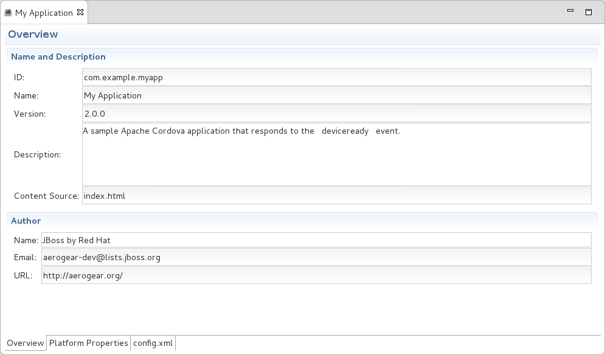

:numbered:
:doctype: book
:toc: left
:icons: font

[[sect-overview-of-hybrid-mobile-tools-and-cordovasim]]
== Overview of Hybrid Mobile Tools and CordovaSim

[[about-apache-cordova]]
=== About Apache Cordova

Apache Cordova is a framework for hybrid mobile application development.
It simplifies mobile application development by enabling developers to use device-independent APIs, in place of native code, to access device functionality.

Cordova consists of plug-ins, each providing a wrapper API to gain access to corresponding native device APIs.
Cordova APIs are available for a range of device functionality, including cameras, accelerometers, and filesystems.
All of the Cordova APIs have a JavaScript interface and native backing code to support a variety of different device operating systems, including Android and iOS.

The JavaScript interface of Cordova APIs provides consistent methods for accessing native device functionality regardless of operating system.
Applications using Cordova are written once and packaged using native software development kits (SDKs) to produce hybrid mobile applications.

Cordova applications have a distinctive project structure: 

* An essential [file]`config.xml` file holds information about the application.
  It specifies features, preferences and access details that affect how the application works, for example whether the application responds to orientation changes.
* An application is implemented as a web page.
  The default starting page is [file]`index.html` and device-independent resources are stored in a [file]`www` directory.
* An application must reference the [file]`cordova.js` file, which holds necessary API bindings that enable the application to interact with device features.

Apache Cordova is an open source project, of which there are various distributions.
PhoneGap, in addition to being the originator of Cordova, and IBM Worklight are such distributions.

[[about-hybrid-mobile-tools]]
=== About Hybrid Mobile Tools

Hybrid Mobile Tools provides tooling for developing Cordova-based hybrid mobile applications within the IDE. It simplifies the process of getting started with the Cordova technology that can be used for these types of applications and provides workflows for developing Cordova-based hybrid mobile applications.

Hybrid Mobile Tools consists of the Apache Cordova API and wizards, a dedicated editor and actions for developing Cordova-based hybrid mobile applications for Android and iOS operating systems: 

* The Hybrid Mobile Application project wizard creates a sample project to demonstrate the Cordova project structure and provides you with a template from which to create your own applications.
* The Cordova Configuration Editor offers simplified management of [file]`config.xml` files, with dedicated tabs for adding and editing project descriptions, features, preferences and access.
  An additional tab enables direct editing of [file]`config.xml` files.
* The Cordova Plug-in Discovery wizard assists you to add Cordova plug-ins to your projects.
  Plug-ins can be installed from the Cordova registry, Git locations and system directories.
  Information displayed in the `Project Explorer` view is extended to show installed plug-ins and enable their management.
* Actions are provided for calling external Android and iOS SDKs to package Cordova-based hybrid mobile projects into native applications and subsequently run them on their associated simulators or connected Android devices.
* Export wizards are available for exporting Cordova-based hybrid mobile projects from the IDE workspace as Cordova-enabled Android or iOS projects and ready-to-sign applications.

Hybrid Mobile Tools, together with CordovaSim, provides a rounded hybrid mobile development and testing environment.

[[about-cordovasim]]
=== About CordovaSim

CordovaSim is a mobile application simulator.
It enables you to view and test Cordova-based hybrid mobile applications through a mobile device simulator.

CordovaSim consists of a device input panel based on an extended version of Apache Ripple, teamed with BrowserSim.
The input panel provides the ability to give sample input for device features to the application, such as camera, geolocation and accelerometer data.
BrowserSim displays and enables user interaction with the application.

Extensions to the device input panel for CordovaSim include the following:

* CordovaSim supports a range of Cordova API implementations: the core Apache Cordova plug-ins, several PhoneGap plug-ins and custom plug-ins.
  Supported PhoneGap plug-ins include `BarcodeScanner`, `InAppBrowser` and `ChildBrowser`.
  (Note that exceptions to the supported core Apache Cordova plug-ins are `File` and the `captureAudio` and `captureVideo` methods of `Capture`.)
* CordovaSim automatically injects an up-to-date version of the [file]`cordova.js` library into your project code at simulation time in the case that it is missing.
  Typically this file is added when a project is built with a native SDK. This response by CordovaSim enables it to simulate applications of Cordova-based hybrid mobile projects and Cordova-enabled Android projects without requiring native SDKs.
* The use of BrowserSim for displaying the application extends the functionality of the mobile application simulator to encompass all of the BrowserSim functionality.
  This functionality includes skins, screen captures and LiveReload.

[[system-requirements-for-hybrid-mobile-tools]]
=== System Requirements for Hybrid Mobile Tools

[]##The overall system requirements of JBoss Tools are applicable for Hybrid Mobile Tools and can be viewed at https://community.jboss.org/wiki/MatrixOfSupportedPlatformsRuntimesAndTechnologiesInJBossToolsJBDS[] on the JBoss Tools website.## But, as reiterated below, there are additional system requirements and restrictions when using Hybrid Mobile Tools.

Hybrid Mobile Tools actions involving Android and iOS require the associated SDKs to be installed on your system.

NOTE: 
CordovaSim is a standalone simulator for mobile device operating systems, including Android and iOS. It does not require native SDKs to be installed in order to simulate successfully.

Android SDK (including emulator);;
  
  This is available as part of Android Development Tools.
  For further information see http://developer.android.com/sdk/index.html[] on the Android Developers website.
  Note that for Android actions in Hybrid Mobile Tools it is only necessary to install the Android SDK, which includes the Android Emulator.

iOS SDK (including simulator);;
  
  This is available as part of Apple XCode.
  For further information see https://developer.apple.com/xcode/[] on the Apple website.

* See Also:
  <<set-the-android-sdk-location,Set the Android SDK Location>>

[[system-requirements-for-cordovasim]]
=== System Requirements for CordovaSim

[]##The overall system requirements of JBoss Tools are applicable for CordovaSim and can be viewed at https://community.jboss.org/wiki/MatrixOfSupportedPlatformsRuntimesAndTechnologiesInJBossToolsJBDS[] on the JBoss Tools website.## But CordovaSim uses BrowserSim and, as reiterated below, there are additional system requirements and restrictions when using BrowserSim on Microsoft Windows operating systems.

BrowserSim depends on WebKit and, consequently, requires Apple Safari to be installed on Microsoft Windows operating systems.
Only a 32-bit version of Apple Safari is available for Microsoft Windows operating systems.
To work around this restriction for 64-bit Microsoft Windows operating systems, you must set BrowserSim to use a 32-bit JVM when running in 64-bit versions of []##Eclipse##.
Note that 32-bit JVM choice is limited to Oracle 32-bit JRE 1.6, JDK 1.6, or JDK 1.7 on Microsoft Windows operating systems because Oracle 32-bit JRE 1.7 is incompatible with Apple Safari.

If BrowserSim is already installed, it can be set to use a 32-bit JVM either before or after installing CordovaSim.
To set BrowserSim to use a 32-bit JVM, click `Window`&rarr;`Preferences`.
Expand `JBoss Tools` and select `BrowserSim/CordovaSim`.
Under `Select JRE to run BrowserSim`, click `Select` and from the list select a 32-bit JRE or Java developer kit.
Click `Apply` and click `OK` to close the `Preferences` window.

.BrowserSim/Cordova Pane of Preferences Window

[[install-hybrid-mobile-tools-and-cordovasim]]
=== Install Hybrid Mobile Tools and CordovaSim

Hybrid Mobile Tools and CordovaSim are not packaged as part of []##JBoss Tools## installations.
These plug-ins must be installed independently through JBoss Central, as detailed in the procedure below.

[]
* To install these plug-ins, drag the following link into JBoss Central: https://devstudio.jboss.com/central/install?connectors=org.jboss.tools.aerogear.hybrid[].
  Alternatively, in JBoss Central select the `Software/Update` tab.
  In the `Find` field, type `JBoss Hybrid Mobile Tools` or scroll through the list to locate `JBoss Hybrid Mobile Tools + CordovaSim`.
  Select the corresponding check box and click `Install`.
+
.Start the Hybrid Mobile Tools and CordovaSim Installation Process with the Link
image::images/4403.png["To install these plug-ins, drag the following link into JBoss Central: ."]
.+Find Hybrid Mobile Tools and CordovaSim in JBoss Central `Software/Update` Tab
image::images/4404.png["To install these plug-ins, drag the following link into JBoss Central: ."]
* In the `Install` wizard, ensure the check boxes are selected for the software you want to install and click `Next`.
  It is recommended that you install all of the selected components.
* Review the details of the items listed for install and click `Next`.
  After reading and agreeing to the license(s), click `I accept the terms of the license agreement(s)` and click `Finish`.
  The `Installing Software` window opens and reports the progress of the installation.
* During the installation process you may receive warnings about installing unsigned content.
  If this is the case, check the details of the content and if satisfied click `OK` to continue with the installation.
+
.Warning Prompt for Installing Unsigned Content

* Once installing is complete, you are prompted to restart the IDE. Click `Yes` to restart now and `No` if you need to save any unsaved changes to open projects.
  Note that changes do not take effect until the IDE is restarted.

Once installed, you must inform Hybrid Mobile Tools of the Android SDK location before you can use Hybrid Mobile Tools actions involving Android.

* See Also:
  <<set-the-android-sdk-location,Set the Android SDK Location>>

[[sect-features-of-hybrid-mobile-tools-and-cordovasim]]
== Features of Hybrid Mobile Tools and CordovaSim

[[features-overview7]]
=== Features Overview

The aim of this section is to guide you in using Hybrid Mobile Tools and CordovaSim:

* Create the basis of new hybrid mobile projects using the project wizard
* Add and remove Cordova plug-ins from your applications
* Manage the Cordova functionality of applications using the Cordova Configuration Editor
* Run and test hybrid mobile applications with CordovaSim or call external Android and iOS SDKs to run applications on their associated simulators and, in the case of Android, attached devices
* Customize the settings used by CordovaSim, Android and iOS simulators for running hybrid mobile applications
* Export workspace applications as Cordova-enabled native projects or ready-to-sign applications

[[create-a-hybrid-mobile-project]]
=== Create a Hybrid Mobile Project

A project wizard is available to assist you in generating new hybrid mobile applications, as demonstrated in the procedure below.
It creates a Cordova project with structure compatible with projects generated by the Cordova command-line interface (CLI).

[]
* Click `File`&rarr;`New`&rarr;`Project`.
* Expand `Mobile`, select `Hybrid Mobile (Cordova) Application Project` and click `Next`.
+
.Select `Hybrid Mobile Application Project` in New Project Wizard

Complete the following fields: 

* In the `Project name` field, type a name for the project.
  This value is the name of the directory to be created and in which the source files for the application are stored, for example `My_App`.
* In the `Name` field, type a name by which the hybrid mobile application is to be known.
  This value is the display text used to represent the application in listings and device home screens, for example `My Application`.
* In the `ID` field, type an ID for the hybrid mobile application.
  The value is typically a reverse domain-style identifier, for example `com.example.myapp`, and for applications that are to be distributed through device platform application stores the ID value will be provided by the store.
+
NOTE: 
There are restrictions on the ID you can use for an application.
IDs must consist only of alphanumeric characters and dots.
IDs must begin with an alpha character and contain at least one dot.

+
.`Hybrid Mobile Application Project` Wizard
image::images/4406.png["In the Project name field, type a name for the project. In the Name field, type a name by which the hybrid mobile application is to be known. In the ID field, type an ID for the hybrid mobile application."]
* By default, the project is created in a subdirectory of the workspace that is named according to the project name.
  To change the default location, clear the `Use default location` check box.
  From the `Choose file system` list, select the `default` or `RSE` (Remote System Explorer) as appropriate.
  In the `Location` field, type the path where the project is to be created or click `Browse` to navigate to the location.
* To create the project, click `Finish`.

During project creation, the wizard imports project dependencies and populates a [file]`config.xml` file.
Once created, the project is listed in the `Project Explorer` view and the [file]`config.xml` file is automatically opened in the `Cordova Configuration Editor`.

[[enable-cordova-plug-ins-for-an-application]]
=== Enable Cordova Plug-ins for an Application

Plug-ins, or features, provide the application with access to the necessary Cordova APIs at runtime.
Hybrid Mobile Tools provides actions for installing and removing plug-ins associated with applications, as detailed here.

Add a plug-in;;
  
  In the `Project Explorer` view, right-click the [file]`plugins` folder of the project and click `Install Cordova Plug-in`.

Remove a plug-in;;
  
  In the `Project Explorer` view, in the plugins folder right-click the plug-in and click `Remove Cordova Plug-in`.

NOTE: 
Alternatively, you can add and remove plug-ins by using the `Platform Properties` tab of the Cordova Configuration Editor.

* See Also:
  <<manage-cordova-settings-in-the-platform-properties-tab,Manage Cordova Settings in the Platform Properties Tab>>

[[sect-manage-cordova-settings-of-a-hybrid-mobile-project]]
=== Manage Cordova Settings of a Hybrid Mobile Project

The Cordova Configuration Editor is available for managing the settings of Cordova projects that are specified in the [file]`config.xml` file.
This editor has three tabs: Overview, Platform Properties, and config.xml.
As described below, the first two tabs provide interfaces for configuring the settings specified in the [file]`config.xml` file and the third tab enables direct editing of the file.

The `Overview` tab details explanatory application information.
Within this tab you can specify the name and description of the project, the content source of the application, and author details.

.`Overview` Tab of the Cordova Configuration Editor

The `Platform Properties` tab specifies Cordova project functionality, such as features (plug-ins and parameters), preferences and access.

.`Platform Properties` Tab of the Cordova Configuration Editor

The `config.xml` tab provides an editor in which to view and modify the [file]`config.xml` file directly.

.`config.xml` Tab of the Cordova Configuration Editor

To open the Cordova Configuration Editor for a specific hybrid mobile project, in the `Project Explorer` view right-click the [file]`config.xml` file.
Click `Open With`&rarr;`Cordova Configuration Editor`.
All changes to the Cordova settings of a project must be saved before the results take effect.
To save, press `Ctrl+S`.

[[manage-cordova-settings-in-the-overview-tab]]
==== Manage Cordova Settings in the Overview Tab

The Overview tab of the Cordova Configuration Editor enables you to edit the application information of a hybrid mobile project.
Information pertains to the name, description and author of the application.
More specifically, the `Name and Description` section details the application ID, name, version, description and content source or home page.
The `Author` section holds the author name, email and URL. All field values can be edited as detailed below.

Change the value of a variable;;
  
  Click the appropriate field and edit the content.

All changes to [file]`config.xml` must be saved before the results take effect.
To save, press `Ctrl+S`.

[[manage-cordova-settings-in-the-platform-properties-tab]]
==== Manage Cordova Settings in the Platform Properties Tab

The Platform Properties tab of the Cordova Configuration Editor enables you to specify the Cordova settings in your hybrid mobile project.
Features, parameters, preferences and access can be added and removed as detailed below.

Add a feature;;
  
  Features are the Cordova API plug-ins required by the application in order to access native APIs at runtime.
  Examples include `Camera`, `Contacts` and `Geolocation`.

Add a parameter;;
  
  All parameters are associated with a feature and provide information about the specific mapping of Cordova and native APIs.

Add a preference;;
  
  Preferences details the global, cross-platform and platform-specific behaviors for the web view of the hybrid mobile application.

Add access;;
  
  Access entries specify the external network resources to which the application has access, also referred to as whitelisting.

Remove a feature, parameter, preference or access;;
  
  In the appropriate table, select the item to be removed and click `Remove`.
  Note that removing a feature also removes the associated parameters.

All changes to [file]`config.xml` must be saved before the results take effect.
To save, press `Ctrl+S`.

[[run-a-hybrid-mobile-application-on-devices-and-simulators]]
=== Run a Hybrid Mobile Application on Devices and Simulators

You can use the actions of Hybrid Mobile Tools to run applications on devices and simulators, as detailed below.

Run on an Android device;;
  
  In the `Project Explorer` view, right-click the project name and click `Run As`&rarr;`Run on Android Device`.
  This option calls the external Android SDK to package the workspace project and run it on an Android device if one is attached.
  Note that Android APIs and AVDs must be installed and the IDE correctly configured to use the Android SDK for this option to execute successfully.

Run on an Android emulator;;
  
  In the `Project Explorer` view, right-click the project name and click `Run As`&rarr;`Run on Android Emulator`.
  This option calls the external Android SDK to package the workspace project and run it on the Android emulator.
  Note that Android APIs and AVDs must be installed and the IDE correctly configured to use the Android SDK for this option to execute successfully.

Run on iOS Simulator;;
  
  In the `Project Explorer` view, right-click the project name and click `Run As`&rarr;`Run on iOS Emulator`.
  This option calls the external iOS SDK to package the workspace project into an XCode project and run it on the iOS Simulator.

Run with CordovaSim;;
  
  In the `Project Explorer` view, right-click the project name and click `Run As`&rarr;`Run with CordovaSim`.
  This opens the application in CordovaSim, which is composed of a BrowserSim simulated device and a device input panel.

* See Also:
  <<system-requirements-for-hybrid-mobile-tools,System Requirements for Hybrid Mobile Tools>>

[[manage-hybrid-mobile-project-run-configurations]]
=== Manage Hybrid Mobile Project Run Configurations

Run configurations inform simulators how to run the application associated with a project.
Hybrid Mobile Tools generates a default run configuration for a project the first time it is run by a specific simulator.
This default run configuration is simulator-specific and named according to the project name.
You can create and customize multiple run configurations for your projects using the Run Configurations manager.

The information below details how to manage run configurations using the `Run Configurations` manger.
To open the `Run Configurations` manger for a project, in the `Project Explorer` view right-click the project name and click `Run As`&rarr;`Run Configurations`.
Note that run configurations are organized by simulator within the Run Configurations manager, namely CordovaSim, Android and iOS Simulator.

.A CordovaSim Run Configuration Selected in Run Configurations Manager
image::images/4415.png["To open the Run Configurations manger for a project, in the Project Explorer tab right-click the project name and click Run AsRun Configurations. Note that run configurations are organized by simulator within the Run Configurations manager, namely CordovaSim, Android and iOS Simulator."]

Create a run configuration;;
  
  From the list of run environments, right-click the simulator and click `New`.
  Complete the fields as appropriate.
  To save the new run configuration, click `Apply`.

View and edit a run configuration;;
  
  From the list of run environments, expand the simulator.
  This shows a list of the run configurations associated with the simulator.

Run an application using a run configuration;;
  
  From the list of run environments, expand the simulator and select a run configuration.
  Click `Run`.
  This starts the simulator, which runs the application associated with the project using the specified configuration settings.

[[export-a-hybrid-mobile-project]]
=== Export a Hybrid Mobile Project

Hybrid Mobile Tools provides actions for exporting workspace projects from the IDE. Projects can be exported as native projects and ready-to-sign applications, as detailed in the procedure below.

IMPORTANT: 
Android and iOS APIs must be installed and the IDE correctly configured to use the Android SDK for this procedure to execute successfully.

[]
* In the `Project Explorer` view, right-click the project name and click `Export`.
* Expand `Mobile`, select the export type as appropriate and click `Next`:
+
* To export as an application, select `Export Mobile Application`.
* To export as a native project, select `Export Native Platform Project`.
+
.Select from the Mobile Export Types in the Export Wizard
image::images/4412.png["Expand Mobile, select the export type as appropriate and click Next. To export as an application, select Export Mobile Application. To export as a native project, select Export Native Platform Project."]

Complete the following fields: 

* From the `Select Projects` list, select the check boxes of one or more workspace projects to be exported.
* From the `Select Platforms` list, select the check boxes of one or more operating systems for which you want to export the selected project.
  Only operating systems with installed SDKs are listed.
* * In the `Directory` field, type the path to which the projects are to be exported or click `Browse` to navigate to the location.
+
.Provide Export Settings in the Export Wizard
image::images/4413.png["From the Select Projects list, select the check boxes of one or more workspace projects to be exported. From the Select Platforms list, select the check boxes of one or more operating systems for which you want to export the selected project. In the Directory field, type the path to which the projects are to be exported or click Browse to navigate to the location."]
* Click `Finish`.
  Projects are exported to the specified location.
  Exported native projects are organized with subdirectories for each selected operating system.

* See Also:
  <<system-requirements-for-hybrid-mobile-tools,System Requirements for Hybrid Mobile Tools>>

[[sect-customizing-hybrid-mobile-tools-and-cordovasim]]
== Customizing Hybrid Mobile Tools and CordovaSim

[[customizing-overview7]]
=== Customizing Overview

The aim of this section is to guide you in customizing Hybrid Mobile Tools and CordovaSim:

* Specify an Android SDK location

[[set-the-android-sdk-location]]
=== Set the Android SDK Location

You must inform Hybrid Mobile Tools of the Android SDK location before you can use Hybrid Mobile Tools actions involving Android.

To set the Android SDK location, click `Window`&rarr;`Preferences` and select `Hybrid Mobile`.
In the `Android SDK Directory` field, type the path of the installed SDK or click `Browse` to navigate to the location.
Click `Apply` and click `OK` to close the `Preferences` window.

.Hybrid Mobile Pane of Preferences Window

