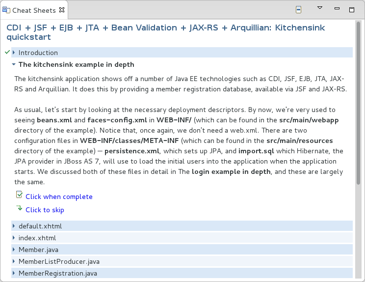
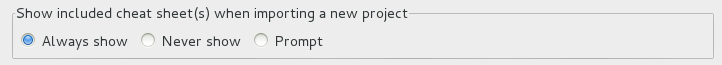

:numbered:
:doctype: book
:toc: left
:icons: font

[[sect-overview-of-jboss-central-and-the-jboss-perspective]]
== Overview of JBoss Central and the JBoss Perspective

[[about-jboss-central]]
=== About JBoss Central

JBoss Central is a core IDE view, providing access to JBoss information and assistance in one centralized location.
It offers features for first time users of JBoss Tools, as well as those with more experience.

JBoss Central comprises resources and actions for creating new projects, learning about the tools and installing software updates: 

* Project wizards create new projects based on sample applications and different technologies.
* The TicketMonster tutorial, part of JBoss Java Developer Framework, demonstrates how to use the IDE to best advantage in developing a complex web application that utilizes JBoss technologies.
* Links to JBoss blog posts give timely insight into JBoss developments and the links to JBoss resources, such as documentation and forums, provide easy access to key information sources.
* Software installation and update information assist in the easy management of IDE plug-ins.

[[about-the-jboss-perspective]]
=== About the JBoss Perspective

JBoss is a key IDE perspective, giving easy access to useful views and actions when developing applications with JBoss technologies.
The perspective consists of a default set of views, menus and toolbars.

Views;;
  
  The default views of the JBoss perspective are JBoss Central, OpenShift Explorer, Outline, Package Explorer, Palette, Problems, Project Explorer, Properties, and Servers.
  These views are vital when developing with JBoss technologies.

Menus;;
  
  The default menus of the JBoss perspective are File, Edit, Navigate, Search, Project, Run, Window, Help.
  These are shared with other perspectives but contain unique menu items for actions such as starting project wizards, converting line delimiters, showing items in JBoss perspective views, generating Javadoc, building packages, accessing JBoss Central and cheat sheets, and reporting problems with tools.

Toolbars;;
  
  The default toolbars that compose the global toolbar of the JBoss perspective are BrowserSim, Debug, File, Help, Java EE, Java Element Creation, JBoss Tools WTP Server Actions, Launch, Navigate, Search, Select Maven Profiles, and Web Browser.
  The global toolbar provides access to frequently used actions.

[[sect-features-of-jboss-central-and-the-jboss-perspective]]
== Features of JBoss Central and the JBoss Perspective

[[features-overview]]
=== Features Overview

The aim of this section is to guide you in using JBoss Central and the JBoss perspective:

* View JBoss Central to access project wizards and information resources
* Install and update software with JBoss Central
* Open the JBoss perspective for easy access to key views, menus and toolbars
* Access cheat sheets that assist in project development

[[view-jboss-central]]
=== View JBoss Central

JBoss Central provides resources for getting started with application development and installing auxiliary IDE software.

To open JBoss Central, click the `JBoss Central` icon 
.
Alternatively, click `Help`&rarr;`JBoss Central`.

To maximize JBoss Central so that it fills the IDE window, double-click the `JBoss Central` view label.
To reduce JBoss Central to its smaller size, double-click the `JBoss Central` view label again.
These maximizing and minimizing actions work for all IDE views.

[[access-project-wizards-in-jboss-central]]
=== Access Project Wizards in JBoss Central

JBoss Central provides access to wizards for generating projects.
There are two types of project wizards available in JBoss Central: `Start from scratch` and `Start from a sample`.

`Start from scratch`;;
  
  These wizards create the same project using different underlying technology, as stated in the project name.
  To view a project summary, hover the cursor over a project wizard.
  If you do not have the necessary plug-in installed to use a wizard, you are prompted to install it when you click the wizard.

.Start from Scratch Wizards
image::images/3963.png["The Start from scratch wizards create the same project using different underlying technology, as started in the project name. To view a project summary, hover the cursor over a project wizard."]
`Start from a sample`;;
  
  These wizards create sample web, mobile, back-end and portal applications.
  To view a project summary, hover the cursor over a project wizard.

.Start from Sample Wizards
image::images/4347.png["The Start from a sample wizards create sample web, mobile, back-end and portal applications. To view a project summary, hover the cursor over a project wizard."]

To create a project from one of the wizards, in JBoss Central select the `Getting Started` tab.
Click one of the links below `Start from scratch` or `Start from a sample`.
Alternatively, click `File`&rarr;`New` and select a project from the list.
A wizard opens to guide you through the process of creating the project.

Additionally, access is provided to the comprehensive TicketMonster tutorial, part of JBoss Developer Framework.
The tutorial guides you through developing a complex web application utilizing JBoss technologies from within the IDE. To view the tutorial, in JBoss Central select the `Getting Started` tab and click the `TicketMonster` link.
The JBoss Developer Framework website opens in the default IDE browser.

.Access the TicketMonster Tutorial

[[access-information-in-jboss-central]]
=== Access Information in JBoss Central

JBoss Central provides easy access to JBoss and developer information.
Each of the information sources listed below are web-based and, depending on the IDE default browser setting, clicking on links results in an internal or external browser window opening.

View the JBoss Tools website;;
  
  In JBoss Central, click the `JBoss Tools Home` icon 
  .

View the latest JBoss developments;;
  
  In JBoss Central, select the `Getting Started` tab and click the links under `JBoss Buzz`.
  To see previews of the blog posts, hover the cursor over these links.
  To view a complete list of JBoss blog posts, click the `JBoss Buzz` button 
  image:images/4272.png[""].
  JBoss blog posts are available to follow as RSS feeds or with Twitter.
  To review these options, click the `News` or `Twitter` icons.

.JBoss Buzz
image::images/4228.png["In JBoss Central, select the Getting Started tab and click the links under JBoss Buzz. To see previews of the blog posts, hover the cursor over these links. To view a complete list of JBoss blog posts, click the JBoss Buzz button."]
View JBoss developer information sources;;
  
  In JBoss Central, select the `Getting Started` tab and click the links under `Other resources`.
  These links provide access to videos, documentation and forums.

.Other Resources
image::images/3966.png["In JBoss Central, select the Getting Started tab and click the links under Other resources."]
Search the JBoss Community website;;
  
  In JBoss Central, click the arrow next to the search box and select `Search JBoss Community`.
  In the search field, enter the search terms.

.Search the JBoss Community Website

NOTE: 
To change the default IDE browser, click `Window`&rarr;`Web Browser` and select a browser from the listed options.

[[install-software-in-jboss-central]]
=== Install Software in JBoss Central

JBoss Central enables you to install and update a range of IDE plug-ins.
The available plug-ins comprise JBoss and third-party plug-ins that have been specifically tested for use with the IDE. These plug-ins include ones for mobile and web development, source control management, utilities and Maven.

For all actions listed below, open JBoss Central and select the `Software/Update` tab.

View available software;;
  
  The available software is listed in the table.
  To refresh the list of available plug-ins, click the `Refresh` icon 
  image:images/3969.png[""].

View installed plug-ins;;
  
  Select the `Show Installed` check box.
  The installed plug-ins are listed in the table as disabled.

.`Show Installed` Check Box Selected and Installed Plug-ins Listed as Disabled
image::images/4346.png["To view installed plug-ins, select the Show Installed check box. The installed plug-ins are listed in the table as disabled."]
Install available software;;
  
  In the `Find` field, type the name of the software or scroll through the list to locate it.
  Select the check box corresponding to the software you want to install and click `Install` or click the `Install` icon 
  image:images/3979.png[""].

.Find and Install Software
image::images/4270.png["In the Find field, type the name of the software or scroll through the list to locate it. Select the check box corresponding to the software you want to install and click Install or click the Install icon."]
Check for software updates;;
  
  Click the `Check for Updates` icon 
  image:images/3957.png[""].
  The `Contacting Software Sites` window opens and reports the progress of checking.
  Once checking is complete, a prompt informs you of any new software found.
  Click `OK` to close the prompt.

.Information Window Showing No Updates Found
image::images/3974.png["The Contacting Software Sites window opens and reports the progress of checking. Once checking is complete, a prompt informs you of any new software found. Click OK to close the prompt."]
[[open-the-jboss-perspective]]
=== Open the JBoss Perspective

The JBoss perspective provides a default set of views, menus and toolbars to assist with common tasks associated with developing applications that use JBoss technologies.

To open the JBoss perspective, click `Window`&rarr;`Open Perspective`&rarr;`Other`.
From the list of available perspectives, select `JBoss` and click `OK`.
The views associated with the JBoss perspective open and menus and toolbars change as appropriate.

.Select `JBoss` in the `Open Perspective` Window
image::images/3973.png["To open the JBoss perspective, click WindowOpen PerspectiveOther. From the list of available perspectives, select JBoss and click OK."]
[[manage-the-jboss-perspective]]
=== Manage the JBoss Perspective

There are a number of actions provided by the IDE for managing perspectives, including the JBoss perspective.

Reset the JBoss perspective;;
  
  Click `Window`&rarr;`Reset Perspective`.
  At the prompt asking if you want to reset the current JBoss perspective to its default settings, click `Yes`.
  This action resets the views to their original size and position and reverts the contents of menus and toolbars to their original listings.

Switch to the JBoss perspective;;
  
  Click the `JBoss` icon 
  .
  Alternatively, to view a list of open perspectives, click `Window`&rarr;`Navigation`&rarr;`Next Perspective` or press and hold `Ctrl` and press `F8`.
  From the list of perspectives, select the JBoss perspective or press `F8` repeatedly until the JBoss perspective is selected.
  This action is useful if you are using multiple perspectives.

Close the JBoss perspective;;
  
  Click `Window`&rarr;`Close Perspective`.

[[view-cheat-sheets]]
=== View Cheat Sheets

Typically, cheat sheets contain detailed information about projects, with step by step guidance and explanations for how to create and deploy applications.
JBoss Central and the JBoss perspective provide actions to make the cheat sheets that accompany projects easier to access and view.

A cheat sheet contained in a project is automatically opened in the `Cheat Sheets` view when the project is imported into the workspace with `File`&rarr;`Import`.

.Cheat Sheet Open in Cheat Sheets View

To open a cheat sheet manually, in the `Project Explorer` view right-click the project name or a cheat sheet file and click `Open In Cheat Sheets View`.
Alternatively, click `Help`&rarr;`Cheat Sheets`, click `Select a cheat sheet from a file` and type the location of the file in the field or click `Browse` to navigate to the file.
Click `OK` to close the window.
The cheat sheet opens in the `Cheat Sheets` view.

NOTE: 
If the cheat sheet file name begins with dot, it may not be automatically visible in the `Project Explorer` view.
To change the viewing preferences of the `Project Explorer` view, click the `View Menu` icon and click `Customize View`.
In the `Filters` tab, clear the `.* resources` check box and click `OK`.

[[sect-customizing-jboss-central-and-the-jboss-perspective]]
== Customizing JBoss Central and the JBoss Perspective

[[customizing-overview6]]
=== Customizing Overview

The aim of this section is to guide you in customizing JBoss Central and the JBoss perspective:

* Make JBoss Central visible when the IDE starts
* Customize the views, menus and toolbars of the JBoss perspective
* Enable offline availability of JBoss Central elements, such as project examples and auxiliary plug-ins
* Specify the default IDE behavior for cheat sheets

[[change-the-behavior-of-jboss-central-on-ide-start]]
=== Change the Behavior of JBoss Central on IDE Start

JBoss Central is set by default to show when the IDE starts but you can customize this behavior.

To change the behavior, in JBoss Central select or clear the `Show on Startup` check box as appropriate.

.Show on Startup Check Box

Alternatively, in JBoss Central click the `Preferences` icon 
 or click `Window`&rarr;`Preferences`.
In both cases, expand `JBoss Tools` and select `JBoss Central`.
Select or clear the `Show JBoss Central on Startup` check box as appropriate.
Click `Apply` and click `OK` to close the `Preferences` window.

.Set JBoss Central Behavior in JBoss Central Pane of Preferences Window
image::images/3970.png["In JBoss Central, click the Preferences icon or click WindowPreferences. In both cases, expand JBoss Tools and select JBoss Central. Select or clear the Show JBoss Central on Startup check box as appropriate. Click Apply and click OK to close the Preferences window."]
[[customize-the-default-views-menus-and-toolbars-of-the-jboss-perspective]]
=== Customize the Default Views, Menus and Toolbars of the JBoss Perspective

You can customize the views, menus and toolbars displayed by the JBoss perspective, as with any perspective.

For all actions listed below, ensure the JBoss perspective is the current perspective.

Customize views;;
  
  Open or close views as desired and click `Window`&rarr;`Save Perspective As`.
  From the `Existing Perspectives` list, select `JBoss` and click `OK`.
  At the prompt asking if you want to overwrite the existing JBoss perspective, click `Yes`.

.Save Perspective As Window
image::images/3964.png["Open or close tabs as desired and click WindowSave Perspective As. From the Existing Perspectives list, select JBoss and click OK."]
Customize menu and toolbar elements;;
  
  Click `Window`&rarr;`Customize Perspective`.
  In the `Tool Bar Visibility` tab, select or clear the check boxes corresponding to the individual toolbars and icons visible in the global toolbar of the JBoss perspective as appropriate.
  In the `Menu Visibility` tab, select or clear the check boxes corresponding to the menus and menu items visible in the JBoss perspective as appropriate.
  Disabled items in the `Tool Bar Visibility` and `Menu Visibility` tabs can be activated in the `Command Groups Availability` tab.
  Click `OK` to save any changes and close the window.

.`Tool Bar Visibility` Tab in Customize Perspective Window
image::images/3986.png["Click WindowCustomize Perspective. In the Tool Bar Visibility tab, select or clear the check boxes corresponding to the individual toolbars and icons visible in the global toolbar of the JBoss perspective as appropriate. Click OK to save any changes and close the window."]
Reorder the individual toolbars comprising the global toolbar;;
  
  Click the vertical dashed line indicating the beginning of an individual toolbar and drag the toolbar to its new location in the global toolbar.

.Select and Drag a Toolbar to Reorder the Global Toolbar
image::images/3968.png["Click the vertical dashed line indicating the beginning of an individual toolbar and drag the toolbar to its new location in the global toolbar."]
Revert all perspective customizations;;
  
  Click `Window`&rarr;`Reset Perspective`.
  At the prompt asking if you want to reset the JBoss perspective to its saved state, select the `Also discard perspective's customization` check box and click `Yes`.

.Revert Perspective Window
image::images/3967.png["Click WindowReset Perspective. At the prompt asking if you want to reset the JBoss perspective to its saved state, select the Also discard perspective's customization check box and click Yes."]
[[use-project-examples-when-working-offline]]
=== Use Project Examples when Working Offline

When a project wizard in JBoss Central is used, the IDE searches online repositories for the most recent versions of project dependencies.
JBoss Central enables you to create a cache of the necessary project dependencies when you are online so that you can still use the project wizards offline.
As detailed below, this is achieved by first creating the cache and then informing the IDE to use that cache.

IMPORTANT: 
Groovy must be installed and configured as stated in the Groovy documentation.
For more information, see http://groovy.codehaus.org/Installing+Groovy[] at the Groovy website.

IMPORTANT: 
Maven must be correctly configured for all of the project wizards before the cache script is run.
The JBoss Public Maven repository must be specified in [file]`settings.xml`.

To create the cache, click `Window`&rarr;`Preferences`.
Expand `JBoss Tools`&rarr;`Project Examples` and select `Offline Support`.
To run the cache generating script, click `Copy to Clipboard` and paste the selected text on a command line outside the IDE. The script downloads and builds all of the project examples in a new directory [file]`offline`.
The script may take some time to complete.

Once the cache is generated, copy [file]`offline/.jbosstools/cache` to the directory where you want to keep the project examples cache.
Copy the contents of [file]`offline/.m2/repository` to your local maven repository.

To inform the IDE to use the generated project examples cache, click `Window`&rarr;`Preferences`.
Expand `JBoss Tools`&rarr;`Project Examples` and select `Offline Support`.
Select the `Enable offline mode for project examples` check box.
Ensure the correct cache location is specified in the `Offline directory` field.
Click `Apply` and click `OK` to close the `Preferences` window.

.Offline Mode Enabled for JBoss Central Project Examples

[[install-software-when-working-offline]]
=== Install Software when Working Offline

You can install the JBoss and third-party plug-ins listed in JBoss Central in offline mode using the JBoss Central [file]`.zip` file, as detailed below.
This feature is useful if you regularly work offline or if you are installing these auxiliary plug-ins in a number of JBoss&nbsp;Developer&nbsp;Studio installations as it removes the need to repeatedly download the same plug-ins.

Note that the JBoss Central [file]`.zip` file is a snapshot of the plug-ins at the time of the given JBoss&nbsp;Developer&nbsp;Studio release and updated versions of the plug-ins must be installed from JBoss Central in online mode.

NOTE: 
To install JBoss and third-party plug-ins in offline mode, you must first download the JBoss Central [file]`.zip` file.
You can download the JBoss Central [file]`.zip` file from http://download.jboss.org/jbosstools/targetplatforms/jbtcentraltarget/[] on the JBoss Tools website.

* Click `Help`&rarr;`Install New Software`.
* In the `Work with` field, enter the path of the JBoss Central [file]`.zip` file.
  Alternatively, click `Add` and click `Archive` to locate the file.
* Clear the `Group items by category` check box.
  This action makes the contents of the JBoss Central [file]`.zip` file visible in the table of components.
* From the table of components, select the software to be installed and click `Next`.
* Review the details of the items listed for install and click `Next`.
* After reading and agreeing to the license(s), click `I accept the terms of the license agreement(s)` and click `Finish`.
  The `Installing Software` window opens and reports the progress of the installation.
* During the installation process you may receive warnings about installing unsigned content.
  If this is the case, review the details of the content and if satisfied click `OK` to continue with the installation.
* Once installing is complete, you are prompted to restart the IDE. Click `Yes` to restart now and `No` if you need to save any unsaved changes to open projects.
  Note that changes do not take effect until the IDE is restarted.

[[set-cheat-sheet-behavior]]
=== Set Cheat Sheet Behavior

You can specify the default action the IDE is to take when finding cheat sheets in projects that it is importing.
The available options include always or never showing cheat sheets or the IDE prompting for which action to take for each import.

To customize the action, click `Window`&rarr;`Preferences`.
Expand `JBoss Tools` and select `Project Examples`.
From the `Show included cheat sheet(s) when importing a project` list, click one of the options.
Click `Apply` and click `OK` to close the window.

.Set Cheat Sheet Behavior in Project Examples Pane of Preferences Window

