:numbered:
:doctype: book
:toc: left

[[sect-overview-of-jboss-server-tools]]
== Overview of JBoss Server Tools

[[about-jboss-server-tools]]
=== About JBoss Server Tools

JBoss Server Tools is tooling for working with application servers in the IDE. It extends and enhances the existing server functionality of the IDE.

JBoss Server Tools consists of wizards, editors and actions that enable you to define, configure and manage application servers.

Runtime detection is available to assist you in locating installed application servers and integrating them into the IDE ready for use.
Additionally, you can define remote servers for []##JBoss community application servers## in the enhanced New Server wizard, which integrates with the IDE Remote System Explorer (RSE) tool.[]##JBoss Server Tools also allows you to download JBoss community application servers from within the IDE.##

Extensions to the standard IDE New Server wizard and Server Editor allow you to specify and customize more management and behavior settings for servers.
Settings include IDE interaction with servers such as launching, communicating and publishing.
The JBoss Server Editor supports you to manage server settings for global and individual application deployment.

JBoss Server Tools actions enable you to make customizations based on application server type, such as default filesets added to new servers and classpath filesets.
You can also customize the default server used for IDE actions such as 'Run on Server'.

[[about-ide-server-definitions]]
=== About IDE Server Definitions

A server definition is a description of how the IDE is to use an application server.
It informs the IDE of configuration information with which to start, communicate and manage an application server, including application deployment.
As such, a server definition is an essential element for working with an application server in the IDE.

A complete server definition is composed of two items, as listed here.

Server runtime environment;;
  
  This informs the IDE about available local application servers.
  Each server runtime environment defines a specific application server configuration in terms of the application server itself, a configuration file and a Java developer kit.
  By varying the configuration details, one application server can be associated with several server runtime environments.

Server adapter;;
  
  This informs the IDE about management settings for server runtime environments.
  Each server adapter, also referred to as simply a server, completes the definition for a specific server by detailing settings such as access parameters, launch arguments, and publishing options.
  By varying the configuration details, one server runtime environment can have several server adapters associated with it.

You must generate at least one complete server definition for an application server before you can use it in the IDE. To assist you with this, JBoss Server Tools provides runtime detection that automatically generates a complete default server definition for any installed application servers found in a given local system search path.

* See Also:
  <<create-a-default-local-server-definition-with-runtime-detection,Create a Default Local Server Definition with Runtime Detection>>

[[sect-features-of-jboss-server-tools]]
== Features of JBoss Server Tools

[[features-overview1]]
=== Features Overview

The aim of this section is to guide you in using JBoss Server Tools:

* Download JBoss community application servers from with the IDE
* Use runtime detection to locate installed application servers and generate complete server definitions, making them ready for IDE use
* Define custom configured servers, both local and remote, by creating additional runtime environments and server adapters
* Manage server configuration and specify IDE-server interaction with the JBoss Server Editor, including settings such as launch options, publishing frequency and communication ports

[[download-a-jboss-community-application-server]]
=== Download a JBoss Community Application Server

Application servers must be installed on your system in order to deploy applications to local and remote instances of them.
Many application servers must be downloaded from outside the IDE. But JBoss Server Tools can assist you to download JBoss community application servers from within the IDE, as detailed in the procedure below.

[]
* Click `Window`&rarr;`Preferences`, expand `JBoss Tools` and select `JBoss Runtime Detection`.
+
.JBoss Runtime Detection Pane

* Click `Download`.
* From the table, select an application server and click `Next`.
+
.Application Server Options in Download Runtimes Wizard
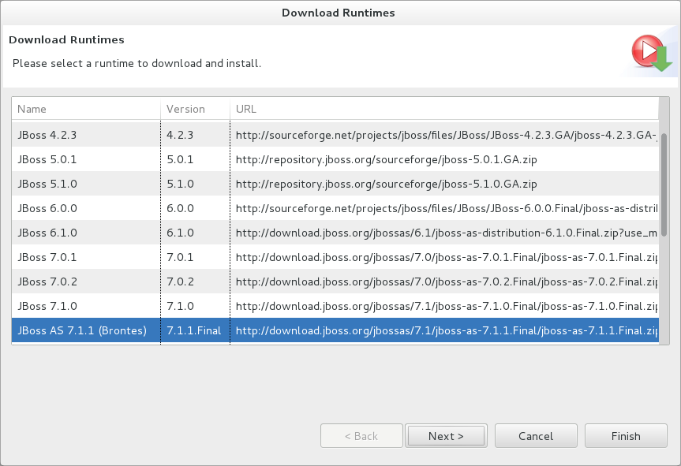
* After reading and agreeing to the terms of the license, click `I accept the terms of this license agreement` and click `Next`.
* In the `Install folder` field, type the path in which the downloaded application server should be installed or click `Browse` to navigate to the location.
+
.Location Options in Download Runtimes Wizard
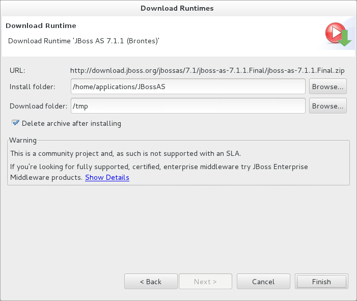
* In the `Download folder` field, type the path to which the application server should be downloaded or click `Browse` to navigate to the location.
* To automatically remove the downloaded archive after installing, select the `Delete archive after installing` check box.
* Click `Finish` to commence downloading and installing.
  The IDE progress bar and `Download` window show the progress of the download process.
  You can click `Run in Background` to close the download window and continue the download process.
* Click `OK` to close the `Preferences` window.

Once downloading is complete, the application server archive is extracted and several automated actions occur:

* The path of the application server is added to the runtime detection `Paths` table.
* A default server runtime environment is generated for the application server.
* A default server adapter is created for the server runtime environment.

NOTE: 
Alternatively, you can download and install JBoss community application servers when adding server runtime environments within `Preferences` under `Server`&rarr;`Runtime Environments`, with the wizard for creating new servers, or with the `Start from scratch` and `Start from a sample` wizards in JBoss Central.

[[create-a-default-local-server-definition-with-runtime-detection]]
=== Create a Default Local Server Definition with Runtime Detection

Before the IDE can use an application sever, you must create a server definition for it.
JBoss Server Tools provides runtime detection that automatically generates a complete default server definition for any installed application servers found in a given local system search path, as detailed in the procedure below.
[]##Note that complete server definitions are also automatically generated for JBoss community servers downloaded with JBoss Server Tools.##

[]
* Click `Window`&rarr;`Preferences`, expand `JBoss Tools` and select `JBoss Runtime Detection`.
+
.JBoss Runtime Detection Pane of Preferences Window
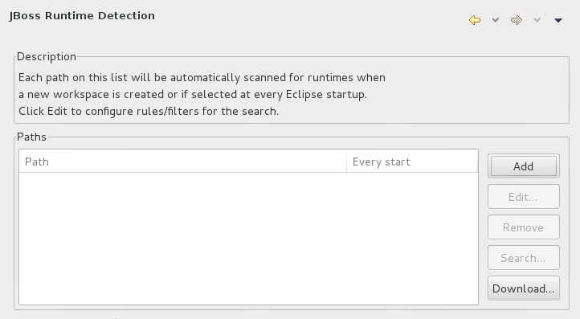
* Click `Add`.
* Select a path from which recursive scanning for application servers is to commence.
  To detect a specific application server, select the install directory for that application server.
  To detect multiple application servers, select a directory higher up the directory tree.
* Depending on the outcome of the scan, follow the appropriate step:
+
+

In all cases, the path is added to the `Paths` table.

* Click `Apply` and click `OK` to close the `Preferences` window.

Generated server runtime environments are listed in `Preferences` under `Server`&rarr;`Runtime Environments`.
A default server adapter is automatically created for each generated server runtime environment to complete the server definition.
Server adapters are listed in the `Servers` view.

.Server Adapters Listed in the `Servers` View
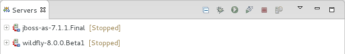
NOTE: 
Alternatively, you can manually define servers by using the IDE server functions to create a server runtime environment and then to create a server adapter.

[[create-an-additional-server-runtime-environment]]
=== Create an Additional Server Runtime Environment

Runtime detection creates a server runtime environment as part of the default server definition for each application server it discovers in given search paths on your system.
But you may want to create additional server runtime environments that specify a variety of JREs or configuration files for a given installed application server.
The procedure below details the process for creating new server runtime environments.
For older versions of application servers, you can also create a new runtime server by cloning an existing one as explained below.

[]
* Click `Window`&rarr;`Preferences`, expand `Server` and select `Runtime Environments`.
+
.Runtime Environments Pane
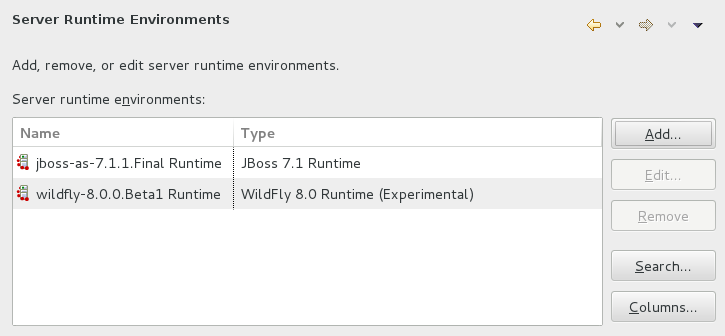
* Click `Add`.

Complete the fields and options as detailed: 

* From the `Select the type of runtime environment` list, select a []##JBoss community application server##.
* To create a complete local server definition, select the `Create a new local server` check box.
+
.Application Server Options in the New Server Runtime Environment Wizard
* image::images/4025.png["From the Select the type of runtime environment list, select a JBoss community application server. To create a complete local server definition, select the Create a new local server check box."]
* Click `Next`.
* Complete the fields and options as detailed:
+
* In the `Name` field, type a name by which to identify the server runtime environment within the IDE.
* In the `Home Directory` field, type the path of the installed application server or click `Browse` to navigate to the location.[]##Alternatively, to use a JBoss community application server that is not already installed on the system, click `Download and install runtime` and follow the instructions.##
* From the `JRE` list, select the JRE to use with the application server.
* In the `Configuration file` field, type the path of the application server configuration file or click `Browse` to navigate to the location.
  Note that the path of the application server configuration file is relative to [file]`Home Directory/standalone/configuration/`, where [file]`Home Directory` is specified in the `Home Directory` field.
+
.Server Runtime Environment Options in the New Server Runtime Environment Wizard
image::images/4027.png["In the Name field, type a name by which to identify the server runtime environment within the IDE. In the Home Directory field, type the path of the installed application server or click Browse to navigate to the location. From the JRE list, select the JRE to use with the application server. In the Configuration file field, type the path of the application server configuration file or click Browse to navigate to the location. Note that the path of the application server configuration file is relative to Home Directory/standalone/configuration/, where Home Directory is specified in the Home Directory field."]
NOTE: +
For older application servers, the `Configuration file` field is replaced with the `Directory` field.
In this field, type the path where the application server configurations are installed and then select a listed configuration.
To clone from an existing server runtime environment, after selecting a listed configuration click `Copy`.
Complete the name for the new configuration and the location where the configuration should be stored and click `OK`.

* Click `Next` if the button is enabled, otherwise click `Finish`.
  The `Next` button is only enabled if you selected the `Create a new local server` check box earlier.
  On the presented page, complete the appropriate information and click `Finish`.
+
.Server Adapter Behavior Options in the New Server Runtime Environment Wizard
image::images/4026.png["Complete the appropriate information for the new server adapter and click Finish."]
+
The new server runtime environment is listed in the `Server runtime environments` table of the `Runtime Environments` pane in the `Preferences` window.

NOTE: 
Alternatively, you can create server runtime environments with the wizard for creating new servers in the `Servers` view or with the `Start from scratch` and `Start from a sample` wizards in `JBoss Central`.

[[define-an-additional-local-server]]
=== Define an Additional Local Server

Runtime detection defines a local server as part of the default server definition for each application server it discovers in given search paths on your system.
But you may want to create additional server adapters that have different configurations for a given server runtime environment in order to define multiple servers.
To create a new server adapter to define a local server, you must use the new server wizard as detailed in the procedure below.

[]
* Click the `Servers` view.
  If the `Servers` view is not visible, click `Window`&rarr;`Show View`&rarr;`Servers`.
* Depending on the number of existing servers, follow the appropriate step:
+
* Complete the fields and options as detailed:
+
* From the `Select the server type` list, select a []##JBoss community application server##.
* The `Server's host name` and `Server name` fields are completed by default.
  In the `Server name` field, you can type a custom name by which to identify the server in the `Servers` view.
* From the `Server runtime environment` list, select an existing server runtime environment for the application server type.
  Alternatively, to create a new runtime environment click `Add` and complete the fields and options as appropriate.
+
.Server Runtime Environment Options in the New Server Runtime Environment Wizard
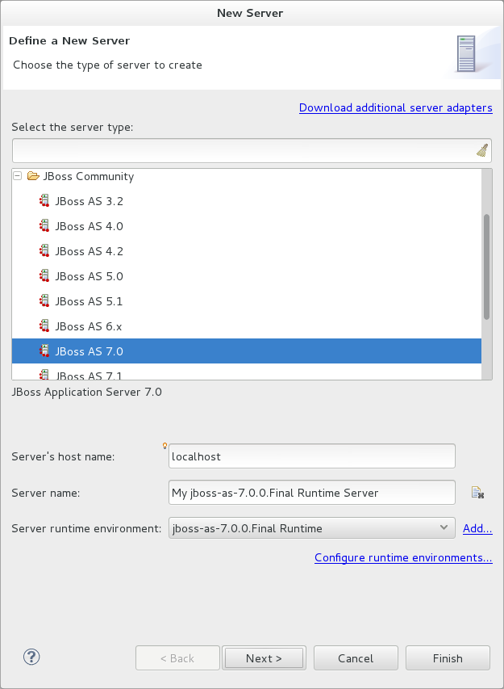
NOTE: +
If the `Server runtime environment` field is not shown, no server runtime environments exist for the selected application server type.
A server runtime environment must be selected before you can successfully create a server adapter and complete the server definition.
To create a new server runtime environment without canceling the wizard, click `Next` and complete the fields and options as appropriate.

* Click `Next`.

The server behavior options displayed vary depending on the selected application server type.
Complete the fields and options as detailed: 

* To specify that the server life cycle will be managed from outside the IDE, select the `Server is externally managed` check box.
* To specify that the server should be launched to respond to requests on all hostnames, select the `Listen on all interfaces to allow remote web connections` check box.
  This option adds the `-b 0.0.0.0` argument to the server launch command.
* From the location list, select `Local`.

* NOTE: 
  The `Expose your management port as the server's hostname` option, which enables management commands sent by the IDE to be successfully received by the server, is bypassed for local servers regardless of whether the check box is selected.
+
.Server Adapter Behavior Options in the New Server Wizard
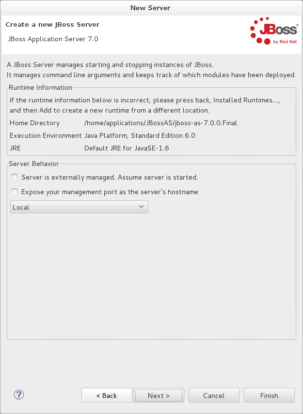
* Click `Next`.
* To select applications to deploy with this server, from the `Available` list select the applications and click `Add`.
  Applications to be deployed are detailed in the `Configured` list.
+
.Add or Remove Server Resources in the New Server Wizard
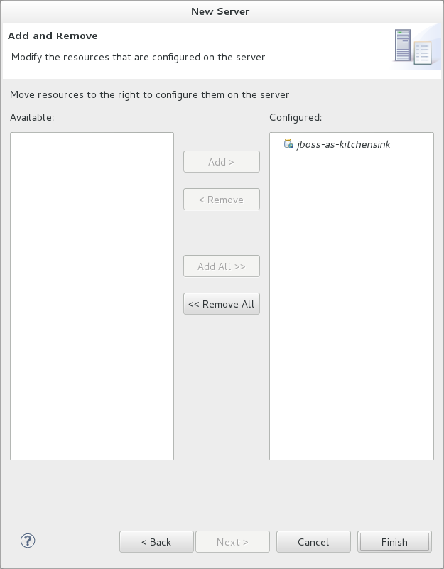
* Click `Finish` to create the server.
  The server is listed in the `Servers` view, with the information in brackets detailing the server status.

IMPORTANT: 
You can create multiple servers that use the same application server.
But a warning is displayed if you try to simultaneously run more than one server on the same host.
This is because multiple running servers on the same host can result in port conflicts.

[[define-a-remote-server]]
=== Define a Remote Server

You can define remote servers for []##JBoss community application servers##.
To complete a server definition, you must create a server adapter, or server, that informs the IDE how to communicate and manage the remote server, as detailed in the procedure below.

IMPORTANT: 
A complete server definition requires a server runtime environment and a server adapter.
Ideally the server runtime environment would be created by specifying the remote application server and remote Java developer kit but server runtime environments can only be created using local components.
To work around this issue, you must have a version of the remote application server and remote Java developer kit installed locally and create a server runtime environment based on these.

[]
* Click the `Servers` view.
  If the `Servers` view is not visible, click `Window`&rarr;`Show View`&rarr;`Servers`.
* Depending on the number of existing servers, follow the appropriate step:
+
* Complete the fields and options as detailed:
+
* From the `Select the server type` list, select a []##JBoss community application server##.
* The `Server's host name` and `Server name` fields are completed by default.
  In the `Server name` field, you can type a custom name by which to identify the server in the `Servers` view.
* From the `Server runtime environment` list, select an existing server runtime environment for the application server type.
  Alternatively, to create a new runtime environment click `Add` and complete the fields and options as appropriate.
+
.Server Runtime Environment Options in the New Server Runtime Environment Wizard

NOTE: +
If the `Server runtime environment` field is not shown, no server runtime environments exist for the selected application server type.
A server runtime environment must be selected before you can successfully create a server adapter and complete the server definition.
To create a new server runtime environment without canceling the wizard, click `Next` and complete the fields and options as appropriate.

* Click `Next`.

The server behavior options displayed vary depending on the selected application server type.
Complete the options as detailed: 

* To specify that the server life cycle will be managed from outside the IDE, select the `Server is externally managed` check box.
* To specify that the server should be launched to respond to requests on all hostnames, select the `Listen on all interfaces to allow remote web connections` check box.
  This option adds the `-b 0.0.0.0` argument to the server launch command.
* To enable management commands sent by the IDE to be successfully received by the server, select the `Expose your management port as the server's hostname` check box.
  This option is useful for remote servers.
+
NOTE: 
To make use of this facility, a management user must exist for the remote server and you must provide the management user credentials to the IDE.

* From the location list, select `Remote System Deployment`.
+
.Remote System Deployment Options in the New Server Wizard
* image::images/4032.png["From the location list, select Remote System Deployment."]
* Complete the additional fields and options for the remote server as detailed:
+
* From the `Host` list, select the host.
  Alternatively, to specify a new host, click `New Host` and follow the instructions.
* In the `Remote Server Home` field, type the path of the application server or click `Browse` to navigate to the location.
* In the `Remote Server Configuration File` field, type the path of the configuration file or click `Browse` to navigate to the location.

* Click `Next`.
* To select applications to deploy with this server, from the `Available` list select the applications and click `Add`.
  Applications to be deployed are detailed in the `Configured` list.
+
.Add or Remove Server Resources in the New Server Wizard

* Click `Finish` to create the server.
  The server is listed in the `Servers` view, with the information in brackets detailing the server status.

[[sect-manage-server-settings]]
=== Manage Server Settings

JBoss Server Tools provides the JBoss Server Editor for managing the settings of servers.
This editor has two tabs: Overview and Deployment.
As described below, each tab enables you to configure fundamental server settings.

The `Overview` tab details the settings for the server.
Within this tab you can provide management information, specify application publishing and reload behavior, and customize port settings.

.Overview Tab of the JBoss Server Editor
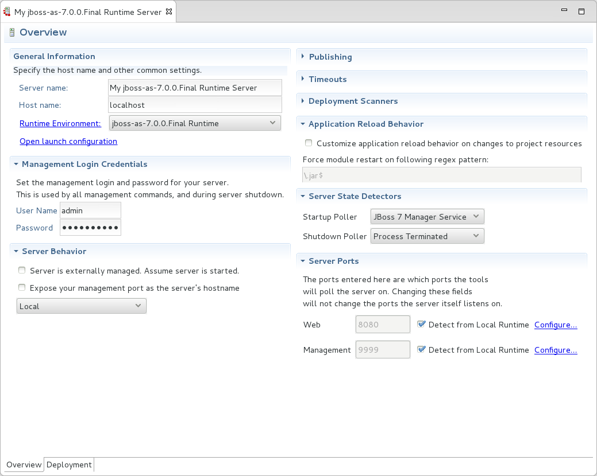

The `Deployment` tab lists applications deployed to the server.
Within this tab you can specify the general publishing behavior for applications and provide deployment settings for individual applications.

.Deployment Tab of the JBoss Server Editor
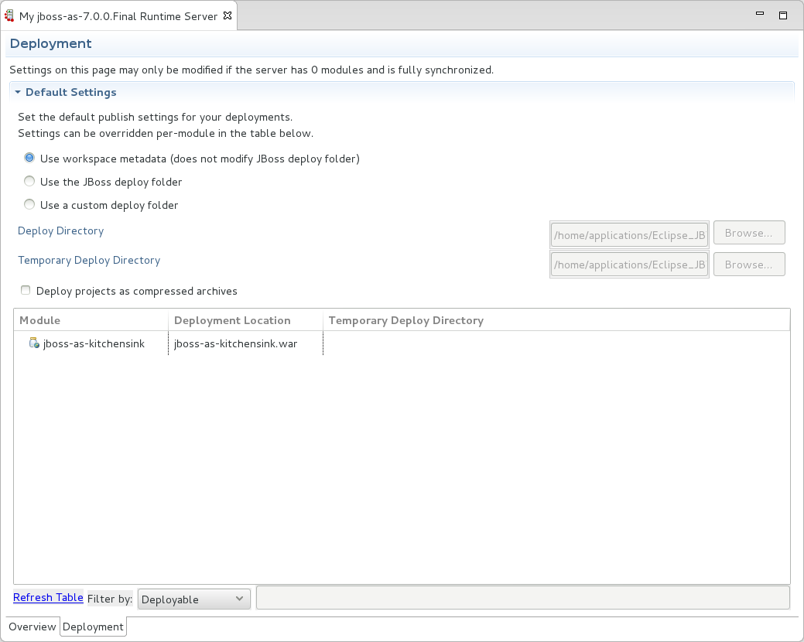

To open the JBoss Server Editor for a specific server, in the `Servers` view double-click the server.
All changes to the settings of a server must be saved before the results will take effect.
To save changes made to server settings in the JBoss Server Editor, press `Ctrl+S`.
You may be required to enter the server management password when making changes to certain settings.

[[manage-server-settings-in-the-overview-tab]]
==== Manage Server Settings in the Overview Tab

The Overview tab of the JBoss Server Editor enables you to vary the management and behavior settings of an individual server.
Each section of the Overview tab is outlined below.
All changes to server settings must be saved before the results will take effect.
To save, press `Ctrl+S`.

General information;;
  
  This section details essential information comprising the server definition: the name by which the server is identified in the IDE, the hostname of the server and the server runtime environment.

Management login credentials;;
  
  This section holds credentials, specifically username and password, necessary for the IDE to successfully communicate management commands with the server.
  The password is obscured and stored in Eclipse Secure Storage for security.
  Incorrect management credentials can cause the IDE to not detect when a server is started.

Server behavior;;
  
  This section enables you to customize server behavior that encompasses how the IDE communicates with the server.

Publishing;;
  
  This section details the publishing action the IDE should take in response to modifications to local resources of deployed applications.
  Publishing involves replacing changed project resources in the dedicated deployment location of a server and the IDE action options are `Never publish automatically`, `Automatically publish when resources change`, and `Automatically publish after a build event`.
  Additionally, you can specify a minimum time interval that must occur between consecutive automated publish actions by the IDE to control the frequency of publishing.

Timeouts;;
  
  This section specifies the maximum length of time, in seconds, the IDE should wait for server actions to complete before aborting.
  The server actions are specifically starting and stopping.

Deployment scanner;;
  
  This section enables you to customize the behavior of deployment scanners, which detect the applications deployed to a server.
  You can manage deployment scanners or allow the IDE to do it for you.
  The management options available are `Add missing deployment scanners after server startup` and `Remove added deployment scanners before shutdown`.

Application reload behavior;;
  
  This section details the application reload action the IDE should take in response to changed published resources of deployed applications.
  Application reload involves undeploying and redeploying an application and this action is necessary when you make changes to project resources that will not be detected by the server.
  By default, the application reload behavior is set to invoke application redeployment when [file]`.jar` files are changed.

Server state detectors;;
  
  This section specifies which method the IDE should use to verify the started and stopped status of the server.

Server ports;;
  
  This section details the ports and port offset that the IDE should use for communication with the server.

[[manage-server-settings-in-the-deployment-tab]]
==== Manage Server Settings in the Deployment Tab

The Deployment tab of the JBoss Server Editor enables you to vary the deployment settings of an individual server.
Each section of the Deployment tab is outlined below.
All changes to server settings must be saved before the results will take effect.
To save, press `Ctrl+S`.

IMPORTANT: 
Changing deployment settings when modules are already deployed can adversely result in multiple deployed copies of an application.
For this reason, many of the functions of the Deployment tab are only enabled when a server is fully synchronized and it has no modules deployed.

Default settings for the server;;
  
  This section specifies where deployments are kept and how they are packaged.

Settings per module;;
  
  This section shows deployment settings for all modules in the workspace regardless of whether they are deployed on the server under consideration.

[[sect-customizing-jboss-server-tools]]
== Customizing JBoss Server Tools

[[customizing-overview1]]
=== Customizing Overview

The aim of this section is to guide you in customizing JBoss Server Tools:

* Enable runtime detection to search paths for application servers on IDE start
* Select a default server for IDE actions
* Specify default file sets that are listed in the `Servers` view for ease of access
* Customize classpath entries for your projects based on application server type

[[enable-runtime-detection-on-ide-start]]
=== Enable Runtime Detection on IDE Start

You can customize runtime detection to automatically search paths for installed application servers when the IDE starts.
If any application servers are found, you are prompted about creating corresponding complete server definitions.

To enable automated searching on IDE start, click `Window`&rarr;`Preferences`.
Expand `JBoss Tools` and select `JBoss Runtime Detection`.
In the `Paths` table, select the `Every start` check box for all of the paths that you want to be automatically searched on IDE start.
Click `Apply` and click `OK` to close the `Preferences` window.

.`Every Start` Check Box Selected for []##JBossAS## Path
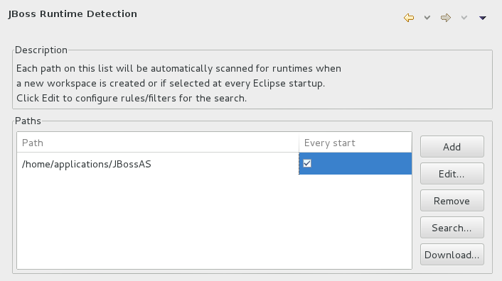
[[set-a-default-server]]
=== Set a Default Server

JBoss Server Tools enables you to select a default server on which to carry out actions such as `Run on server`.
This is useful when you have multiple server instances but use one predominately.

To set a default server, in the global toolbar of the JBoss perspective click the `Select a default server` icon 
.
From the list of existing servers, click the server that you want to set as the default.
Alternatively, to create a new default server click `New Server` and follow the instructions.

.Default Server Menu Option
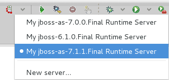
[[default-file-sets]]
=== Default File Sets

File sets are collections of files that are listed under the server in the `Servers` view for ease of access.
JBoss Server Tools generates a default file set for new []##JBoss community application servers## that includes the server configuration file.
But JBoss Server Tools also provides the ability for you to customize default file sets for individual servers and application server types.

To customize the file set for an individual server, in the `Servers` view expand the server.
Right-click `Filesets` and click `Create File Filter`.
In the `Name` field, type a name for the filter.
In the `Root Directory` field, type the path of the directory in which the filter is to be applied or click `Browse` to navigate to the location.
In the `Includes` and `Excludes` fields, type the regex patterns for filtering.
Click `OK` to create the filter.
The new filter is listed under the server in the `Servers` view and expanding the filter shows all of the matching files.

.Create File Filter Menu Option
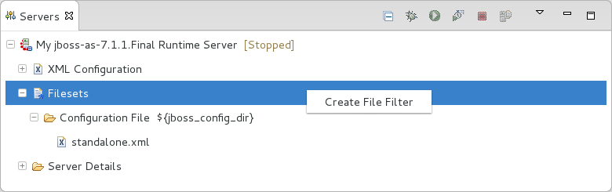
.New File Filter Window
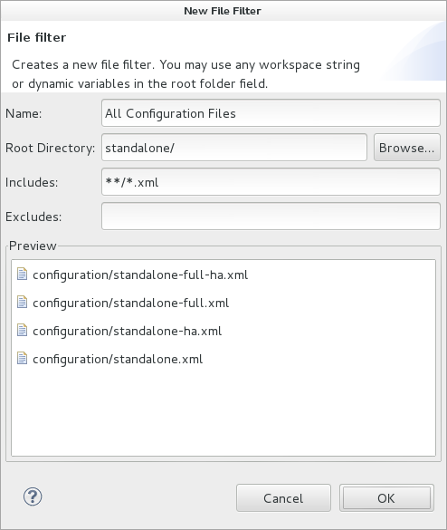

To customize the default file set for an application server type, click `Window`&rarr;`Preferences`.
Expand `Server` and select `Default Filesets`.
From the list, select a []##JBoss community application server## type.
Click `Add` or click `Remove` to customize the default file sets.
Click `Apply` and click `OK` to close the `Preferences` window.

.Default Filesets Pane
image::images/4005.png["To customize the default file set for an application server type, click WindowPreferences. Expand Server and select Default Filesets. From the list, select a JBoss community application server type. Click Add or click Remove to customize the default file sets. Click Apply and click OK to close the Preferences window."]
[[default-classpath-entries]]
=== Default Classpath Entries

Classpath entries specify the availability of [file]`.jar` files for your projects.
JBoss Server Tools generates a default classpath file set for new []##JBoss community application servers## based on the [file]`.jar` files that accompany each.
But JBoss Server Tools also provides the ability for you to customize classpaths for individual servers and application server types.

To customize the classpath file set for an application server type, click `Window`&rarr;`Preferences`.
Expand `Server`&rarr;`Runtime Environments` and select `Default Classpath Entries`.
From the `Select classpath filesets for this runtime type` list, select a []##JBoss community application server## type.
Click `Add` or click `Remove` to customize the classpath file sets.
Click `Apply` and click `OK` to close the `Preferences` window.

.Default Classpath Entries Pane
image::images/4022.png["To customize the classpath file set for an application server type, click WindowPreferences. Expand ServerRuntime Environments and select Default Classpath Entries. From the Select classpath filesets for this runtime type list, select a JBoss community application server type. Click Add or click Remove to customize the classpath file sets. Click Apply and click OK to close the Preferences window."]
