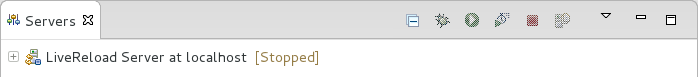
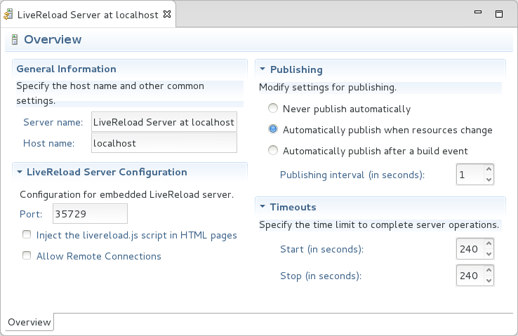
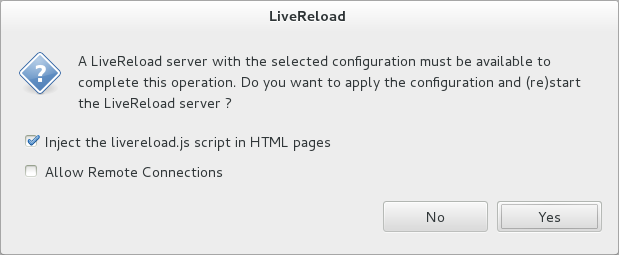
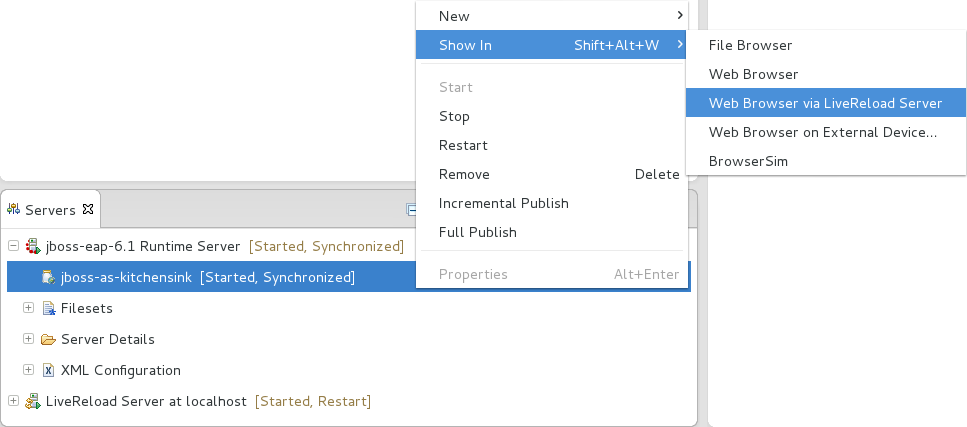
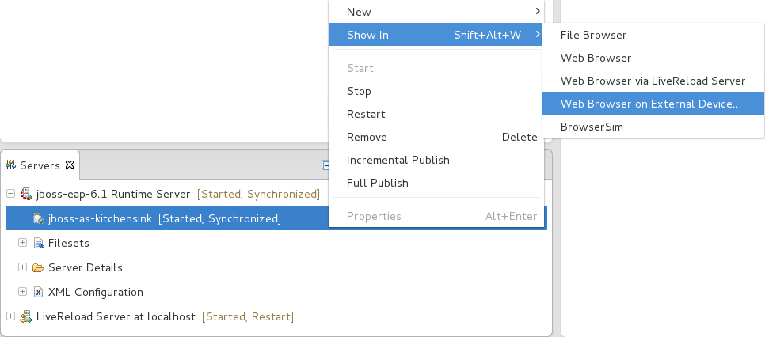
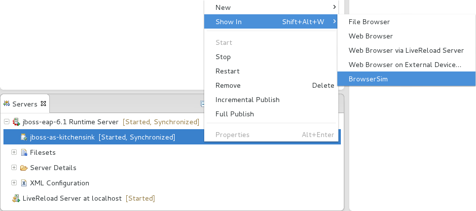
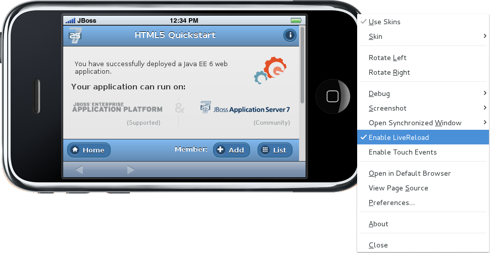

:numbered:
:doctype: book
:toc: left
:icons: font

[[sect-overview-of-livereload-tools]]
== Overview of LiveReload Tools

[[about-livereload]]
=== About LiveReload

LiveReload is an open source tool that refreshes web pages open in browsers as their source is edited.
Immediate and automatic web page refreshing, without the need to manually refresh, assists to simplify the workflow of web developers.

LiveReload consists of server-side and client-side components.
The server-side application monitors the source and sends notifications as the source is changed.
On the client-side, a JavaScript snippet receives the notifications and invokes the browser to refresh the web page.
The server-side and client-side components communicate using the WebSocket protocol, which allows the server-side application to send notifications to the client-side JavaScript snippet.

The JavaScript snippet can be installed and activated using a LiveReload browser extension.
Alternatively, it can be inserted manually in the HTML pages.
Depending upon the changes to the source, the web page is either reloaded or the browser updated instantly without reloading.

The LiveReload application is available for OS X and Microsoft Window operating systems and through a third-party provider for Linux-based operating systems.
LiveReload browser extensions are available for Safari, Chrome and Firefox.

[[about-livereload-tools]]
=== About LiveReload Tools

LiveReload Tools is tooling that implements LiveReload in the IDE. It enables you to take advantage of LiveReload browser refreshing while editing files within the IDE. The capabilities of LiveReload Tools also remove the need to install the LiveReload standalone application or browser extensions.

LiveReload Tools is the implementation of the LiveReload server-side component, which listens to the IDE for resource changes and sends notifications for refreshes as appropriate.
The server can also be configured to inject the livereload.js JavaScript snippet into the source code, which removes the need to install LiveReload browser extensions.

Unique features of LiveReload tools include LiveReload for both workspace and deployed resources due to the use of HTTP protocol for all resources and LiveReload on external devices with access and ease of use for remote connections to LiveReload servers.
The LiveReload server can also be used in conjunction with BrowserSim, extending LiveReload to simulated devices.

[[sect-features-of-livereload-tools]]
== Features of LiveReload Tools

[[features-overview3]]
=== Features Overview

The aim of this section is to guide you in using LiveReload Tools:

* Create a LiveReload server to receive information from the IDE on resource changes
* Configure LiveReload for use with system web browsers and external devices
* View resources in LiveReload-enabled web browsers, including system and external device browsers and BrowserSim

[[create-a-livereload-server]]
=== Create a LiveReload Server

The LiveReload server is integral to the LiveReload integration with the IDE. In its default configuration, the server receives information from the IDE when resources change and sends notifications for refresh actions to be taken.
The server may also be further configured to inject the necessary JavaScript code snippets into HTML files or enable remote connections.
The procedure below guides you through creating a default LiveReload server.

* Click the `Servers` view.
  If the `Servers` view is not visible, click `Window`&rarr;`Show View`&rarr;`Servers`.
* Depending on the number of existing servers, follow the appropriate step:
+
a. If there are no existing servers, click `Click this link to create a new server`.
a. If there are one or more existing servers, right-click an existing server and click `New`&rarr;`Server`.

* From the list of server types, expand `Basic` and select `LiveReload Server`.
+
.LiveReload Server Selected in New Server Wizard
image::images/4079.png["From the list of server types, expand Basic and select LiveReload Server."]
* The `Server's host name` and `Server name` fields are automatically populated.
  The `localhost` value in the `Server's host name` field indicates that the server is to be run on the local system and the value in the `Server name` field is the name by which the LiveReload server is identified in the `Servers` view.
  You can edit these values as appropriate by typing in the fields.
* Click `Finish` to close the window.
  The LiveReload server is listed in the `Servers` view.
+
.LiveReload Server Listed in the `Servers` View

NOTE: 
Alternatively, LiveReload servers can be automatically created when you select to view workspace and deployed resources in web browsers using the actions provided by LiveReload Tools.

[[configure-the-livereload-server]]
=== Configure the LiveReload Server

A LiveReload client must be inserted into HTML files in order for it to receive the LiveReload server notifications about changed resources.
LiveReload Tools provides additional configuration options so that the LiveReload server can inject the necessary `<script>` element into the HTML resources.
Furthermore, the LiveReload server can be configured to allow access from external devices, enabling LiveReload to function in browsers of remote devices.

The details below outline how to set the configuration options using the Server Editor.
To open the Server Editor for a LiveReload server, in the `Servers` view double-click the LiveReload server.
Alternatively, right-click the LiveReload server and click `Open` or press `F3`.

.LiveReload Server Options in the Server Editor

Insert JavaScript code snippet to resources;;
  
  In the Server Editor under `LiveReload Server Configuration`, select the `Inject the livereload.js script in HTML pages` check box.

Enable LiveReload in external device browsers;;
  
  In the Server Editor under `LiveReload Server Configuration`, select the `Allow Remote Connections` check box.
  This option is disabled by default when a LiveReload server is created as it exposes your workspace files, which may not always be desirable.

All changes to the settings of a LiveReload server must be saved and the server restarted before the results will take effect.
To save setting changes, press `Ctrl+S` or click `File`&rarr;`Save` or click the `Save` icon.
To restart the server, in the `Servers` view right-click the LiveReload server and click `Restart`.

[[view-resources-in-livereload-enabled-browsers]]
=== View Resources in LiveReload-enabled Browsers

You can use the actions of LiveReload Tools to open HTML, XHTML and AsciiDoc resources in LiveReload-enabled browsers, as detailed below.
If the requisite LiveReload server does not exist or is not correctly configured, you are prompted by LiveReload Tools, which can complete the necessary requirements for you.
Note that LiveReload Tools functionality may only work with deployed XHTML resources due to their dynamic nature.

NOTE: 
To use LiveReload Tools with AsciiDoc files, you must install the AsciiDoctor.js browser extension from http://asciidoctor.org/news/2013/09/18/introducing-asciidoctor-js-live-preview/[] on the Asciidoctor website.
The browser extension renders AsciiDoc files as HTML and it is available for Chrome and FireFox.

View workspace resources in a web browser;;
  
  In the `Project Explorer` view, right-click the resource file and click `Open With`&rarr;`Web Browser via LiveReload Server`.

.Live Reload Settings Prompt

View deployed resources in a web browser;;
  
  Ensure the server and application of the deployed resources are started.
  In the `Servers` view, right-click the application and click `Show In`&rarr;`Web Browser via LiveReload Server`.

.`Show In`&rarr;`Web Browser via LiveReload Server` Menu Option

View deployed resources on an external device;;
  
  Ensure the server and application of the deployed resources are started.
  In the `Servers` view, right-click the application and click `Show In`&rarr;`Web Browser on External Device`.

.`Show In`&rarr;`Web Browser on External Device` Menu Option

NOTE: 
The configuration of a LiveReload server can be viewed and manually set in the Server Editor.

[[view-resources-in-livereload-enabled-browsersim]]
=== View Resources in LiveReload-enabled BrowserSim

The LiveReload server can be used in conjunction with BrowserSim.
In this case, the server sends notifications about changed resources and BrowserSim inserts the JavaScript code, which invokes the simulated device browser window to refresh.
The procedure below outlines how to enable LiveReload in BrowserSim for workspace and deployed resources.

* Ensure the LiveReload server is started.
  If it is not started, in the `Servers` view right-click the LiveReload server and click `Start`.
* Complete the appropriate step depending on the location of your resources:
+
a. For workspace resources, in the `Project Explorer` view right-click the resource file and click `Open With`&rarr;`BrowserSim`.
a. For deployed resources, in the `Servers` view right-click the application and click `Show In`&rarr;`BrowserSim`.
+
.`Show In`&rarr;`BrowserSim` Menu Option

IMPORTANT: +
Ensure the server and application of the deployed resources are started before attempting to view the resources in LiveReload-enabled BrowserSim.
To start the server and the application, in the `Servers` view right-click each and click `Start`.

* Right-click the simulated device and ensure the `Enable LiveReload` check box is selected.
+
.`Enable LiveReload` Menu Option for BrowserSim

IMPORTANT: 
The `Enable LiveReload` check box has no effect when the LiveReload server is set to insert the JavaScript code and the web resource is viewed in BrowserSim via the LiveReload server port URL. LiveReload is always enabled in this case.
